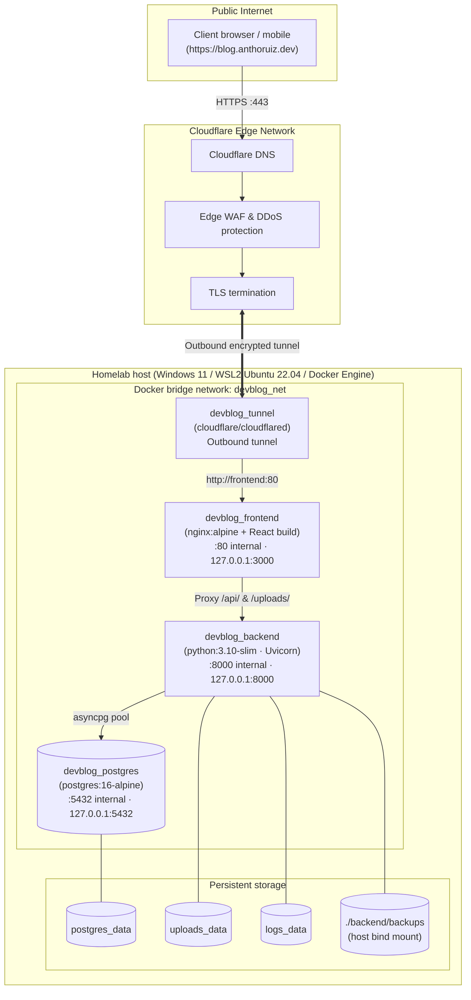
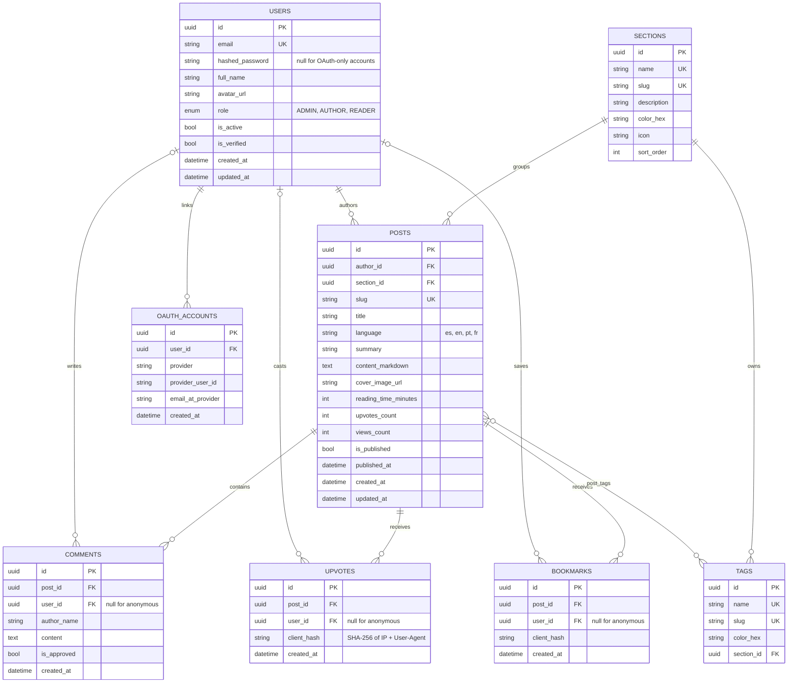

# SYS.BLOG • End-to-End Technical Specification & Architecture Manual

> **Document Version:** 3.2.0 (2026-09-30)  
> **Target Audience:** Systems architects, AI agents, DevOps engineers and full-stack developers  
> **Production URL:** `https://blog.anthoruiz.dev`  
> **Local endpoints:** Production stack: frontend `127.0.0.1:3000`, API `127.0.0.1:8000` · Development stack: frontend `localhost:5173`, API `localhost:8001/docs`

---

## 1. Executive Summary & System Philosophy

**SYS.BLOG** is a self-hosted engineering publication platform and Homelab observability hub. It runs on consumer hardware (a laptop or mini-PC under Windows 11 + WSL2) and is published worldwide through Cloudflare's edge without opening any router ports.

### Core Architectural Tenets
1. **Edge-routed, zero port forwarding:** no residential router ports (80/443) are opened. All ingress traverses an outbound-only encrypted tunnel (`cloudflared`) to Cloudflare's edge. Every other service listens on `127.0.0.1` only.
2. **Secure by default:** secrets are required (no insecure fallbacks), production refuses to start with weak settings, and admin-only surfaces (telemetry, logs, backups, user management) require the `ADMIN` role.
3. **Role-based access control (RBAC):** a 3-tier model (`ADMIN`, `AUTHOR`, `READER`) enforced through FastAPI route dependencies. Roles are assigned by admins only.
4. **Isolated environments:** production and development are separate Docker Compose projects with their own databases, volumes, ports and configuration files.
5. **Autonomous operations:** automatic daily database backups with 7-copy rotation, Docker restart policies, and a deployment script with pre- and post-deploy checks.
6. **AI assistance:** Google Gemini for post translation, tag suggestions and reading-time estimation, with deterministic offline fallbacks.

---

## 2. End-to-End System Topology



---

## 3. Infrastructure & Deployment Specification

### 3.1 Host & Virtualization Layer
- **Hardware:** consumer x86_64 laptop / mini-PC.
- **Operating system:** Windows 11 with WSL2.
- **WSL distribution:** Ubuntu 22.04 LTS with Docker Engine installed **inside WSL**. All Docker commands must run from the `Ubuntu` distribution (`wsl -d Ubuntu`); the Windows Docker CLI (`cmd`, PowerShell, Git Bash) is not connected to this engine.
- **Keep-alive:** keep a `wsl -d Ubuntu sleep infinity` process running on the host so Windows idle/standby does not suspend WSL2 and its network interfaces.

### 3.2 Environments

| | Production | Development |
|---|---|---|
| Compose file / project | `docker-compose.yml` (project `blog`) | `docker-compose.dev.yml` (project `devblog-dev`) |
| Configuration | `.env` | `.env.dev` |
| Containers | `devblog_postgres`, `devblog_backend`, `devblog_frontend`, `devblog_tunnel` | `devblog_dev_postgres`, `devblog_dev_backend` |
| Frontend | Nginx serving the production build · `127.0.0.1:3000` | Vite dev server on the host · `localhost:5173` |
| Backend | Code baked into the image, no reload · `127.0.0.1:8000` | Source mounted, `--reload` · `127.0.0.1:8001` |
| Database | `devblog` · `127.0.0.1:5432` | `devblog_dev` · `127.0.0.1:5433` |
| OpenAPI docs | Disabled | `http://localhost:8001/docs` |
| Seed | 19 starter tags + admin | 19 starter tags + admin + 3 demo posts |
| Cloudflare Tunnel | Yes | No |
| Deploy | `./deploy.sh` | Automatic on save |

The Vite dev server proxies `/api` and `/uploads` to the development backend (`VITE_API_PROXY_TARGET`, default `http://localhost:8001`) — never to production.

### 3.3 Production Container Orchestration (`docker-compose.yml`)

| Container | Service | Image | Internal port | Host binding | Purpose |
|---|---|---|---|---|---|
| `devblog_postgres` | `db` | `postgres:16-alpine` | `5432` | `127.0.0.1:${POSTGRES_PORT}` | Relational persistence with `pg_isready` healthcheck |
| `devblog_backend` | `backend` | Custom (`python:3.10-slim`) | `8000` | `127.0.0.1:8000` | FastAPI API, Gemini integration, backups, telemetry |
| `devblog_frontend` | `frontend` | Multi-stage (`node:20-alpine` → `nginx:alpine`) | `80` | `127.0.0.1:3000` | Nginx reverse proxy and React SPA |
| `devblog_tunnel` | `tunnel` | `cloudflare/cloudflared:latest` | — | — | Outbound edge tunnel connector |

**Configuration contract:** required values use `${VAR:?message}` interpolation, so Compose aborts with a clear error instead of falling back to a default. Required: `POSTGRES_USER`, `POSTGRES_PASSWORD`, `POSTGRES_DB`, `SECRET_KEY`, `ENVIRONMENT`, `CLOUDFLARE_TUNNEL_TOKEN`. Optional settings only default to their safe value (`DEBUG=False`, `ALLOW_ROLE_SELF_SWITCH=False`).

**Volumes:** `postgres_data`, `uploads_data` and `logs_data` are named volumes; `./backend/backups` is bind-mounted so snapshots are visible on the host. `backend/.dockerignore` keeps backups, uploads, logs and `.env*` out of the image.

### 3.4 Deployment (`deploy.sh`)
`./deploy.sh [service...] [--check] [--yes]`, run from WSL:
1. **Environment:** Linux/WSL with a reachable Docker engine; warns if a `docker-compose.override.yml` would be auto-applied.
2. **Configuration:** `.env` must define `SECRET_KEY` (≥ 32 chars), `CLOUDFLARE_TUNNEL_TOKEN`, `POSTGRES_PASSWORD` and `ENVIRONMENT=production`; refuses `ALLOW_ROLE_SELF_SWITCH=True`; runs `docker compose config` to catch unresolved variables.
3. **Git state:** shows branch/commit and lists uncommitted changes under `backend/`, `frontend/` or `docker-compose.yml` (ignoring CRLF-only differences), asking for confirmation.
4. **Deploy:** `docker compose up -d --build --remove-orphans`.
5. **Verification:** all 4 containers running, backend `/health` (up to 60 s), no `--reload`, public site and API respond, and `/api/v1/logs/recent`, `/api/v1/stats/telemetry` and `/api/v1/stats/status` return `401` without a session.

`--check` runs steps 1–3 and 5 without deploying.

### 3.5 Network Ingress & Cloudflare Tunnel
1. **Connector:** `cloudflared tunnel --no-autoupdate run --token ${CLOUDFLARE_TUNNEL_TOKEN}`.
2. **Public hostname:** `blog.anthoruiz.dev` → origin `http://frontend:80` (configured in Cloudflare Zero Trust; unmatched hostnames return 404).
3. **Nginx (`frontend/nginx.conf`):**
   - **Real client IP:** `set_real_ip_from 172.16.0.0/12` + `real_ip_header CF-Connecting-IP`, so `$remote_addr` is the visitor rather than the tunnel container.
   - **Rate limiting:** leaky bucket at `30 r/s` per visitor with `burst=50` (`zone=api_gateway_limit:10m`), HTTP 429 on exhaustion.
   - **Security headers:** `X-Content-Type-Options: nosniff`, `X-Frame-Options: DENY`, `Referrer-Policy: strict-origin-when-cross-origin`, `Permissions-Policy` (camera/microphone/geolocation off); `server_tokens off`.
   - **SPA fallback:** `try_files $uri $uri/ /index.html`.
   - **API proxy:** `/api/` → `backend:8000/api/`, `client_max_body_size 16m` for uploads.
   - **Uploads:** `/uploads/` → backend, cached 30 days, served with `nosniff` and `Content-Security-Policy: default-src 'none'; img-src 'self'; style-src 'unsafe-inline'; sandbox`.
   - **gzip** for text, CSS, JSON, JavaScript and XML.

---

## 4. Backend Architecture (FastAPI & Python 3.10)

### 4.1 Technology Stack
- **Framework:** FastAPI `0.110` on Uvicorn `0.28` (ASGI).
- **ORM & driver:** SQLAlchemy `2.0` async with `asyncpg`.
- **Migrations:** Alembic (`backend/alembic.ini`, `backend/migrations/`), applied automatically on startup by `app/db/migrations.py` (see 4.9).
- **Validation & settings:** Pydantic `2.6` and `pydantic-settings`.
- **Security:** `passlib[bcrypt]` for password hashing, `python-jose` for JWT (HS256, 24 h expiry).
- **Rate limiting:** SlowAPI (in-memory, keyed by `CF-Connecting-IP` / `X-Forwarded-For` / peer address).
- **Monitoring:** `psutil` for host telemetry.
- **HTTP client:** `httpx` for Gemini and Google token verification.

### 4.2 Configuration (`backend/app/core/config.py`)
- `DATABASE_URL` is built from `POSTGRES_USER/PASSWORD/HOST/PORT/DB` with the user and password **percent-encoded**, so passwords may contain `@ : / # %`. A full `DATABASE_URL` can be supplied instead.
- `SECRET_KEY` has no default; startup fails without it.
- **Production guard:** with `ENVIRONMENT=production` the app raises at startup if `SECRET_KEY` is a published default or shorter than 32 characters, or if `ALLOW_ROLE_SELF_SWITCH` is enabled. In development it only prints a warning.
- OpenAPI (`/api/v1/openapi.json`, `/docs`, `/redoc`) is disabled in production.

### 4.3 Database Schema & Entity Relationships

All primary keys are UUIDs.



### 4.4 Sections
Every post and every tag belongs to exactly one section (`section_id`, required, `ON DELETE RESTRICT`). The five sections are created by migration `0003_add_sections`:

| Section | Slug | Color | Icon key |
|---|---|---|---|
| Tech & Coding | `tech` | `#22d3ee` | `code` |
| AI | `ai` | `#a78bfa` | `cpu` |
| Interviews & Career | `career` | `#fb923c` | `target` |
| Mental Health | `mental-health` | `#f472b6` | `heart` |
| Gaming | `gaming` | `#4ade80` | `gamepad` |

Admins can edit name, description and color (`PUT /admin/sections/{id}`); slugs are fixed because they are used in URLs.

**Tag-section validation (`backend/app/services/tag_classifier.py`).** A new tag must fit its section ("WoW" belongs to Gaming, never Tech & Coding):
- With `GEMINI_API_KEY`, Gemini classifies the name against the section names and descriptions and returns `{section_slug, confidence, reason}`. Without a key, or on any Gemini error, a keyword classifier is used (games, consoles, engines, mental-health, interview and AI terms; short keywords match whole words only).
- A tag is rejected only when another section is suggested with confidence ≥ 0.7. Ambiguous or unknown names return no suggestion and never block. Results are cached in memory.
- The editor calls `POST /posts/tags/validate` while the author types (debounced) and offers "Create in <section>"; `POST /posts/tags` enforces the same rule (HTTP 422) unless an admin sends `force: true`.

### 4.5 Seed Data (`seed_initial_data()` in `backend/app/main.py`)
Runs on every startup (after migrations) and only fills what is missing:
1. **Starter tags** (only when the `tags` table is empty) — 19 tags from `DEFAULT_TAGS`, each with its section:
   - *Technology:* Software Engineering, Python, JavaScript & TypeScript, React, Backend & APIs, Databases, Distributed Systems, Cloud & DevOps, Docker & Homelab, Security, AI & Machine Learning
   - *Career & interviews:* Interview Prep, System Design, Algorithms & Data Structures, Career Growth
   - *Wellbeing:* Mental Health, Productivity & Habits
   - *Gaming:* Video Games, Game Development
2. **Admin user** (only when no `ADMIN` exists) — created from `ADMIN_EMAIL` / `ADMIN_PASSWORD`. Without a password, a random one is generated and printed once to stdout (never to `server.log`). Existing admins still using the legacy default password are rotated to `ADMIN_PASSWORD` or reported with a warning.
3. **Demo posts** (only when `SEED_DEMO_POSTS=True` and there are no posts) — three English posts with Unsplash covers in Tech & Coding. Enabled in development, disabled in production.

### 4.6 Security & Role-Based Access Control

| Role | Capabilities |
|---|---|
| **`ADMIN`** | Everything an author can do, on any post · list users and change roles (cannot demote themselves while they are the only admin) · create, download and delete backups · inspect media storage and clean up orphaned uploads · hardware telemetry and system status · recent server logs |
| **`AUTHOR`** | Create posts · edit and delete **own** posts · upload images · create tags · AI translation, tag suggestions and reading-time estimates |
| **`READER`** | Read, upvote, bookmark and comment. Cannot publish or edit |

The first registered account becomes `ADMIN`; every later sign-up is a `READER`. `PUT /auth/me/role` (self role switch) returns `403` unless `ALLOW_ROLE_SELF_SWITCH=True`, which is meant for local testing only.

**Route dependencies (`backend/app/api/deps.py`):**
- `get_current_user_optional` — decodes the Bearer JWT if present, otherwise `None`.
- `get_current_user` — requires a valid token (`401`).
- `get_current_author_or_admin` — requires `AUTHOR` or `ADMIN` (`403`).
- `get_current_admin` — requires `ADMIN` (`403`).
- `get_client_hash` — SHA-256 of IP + User-Agent for anonymous upvotes/bookmarks.

**Additional controls:**
- **Google sign-in endpoint:** tokens verified via Google `tokeninfo` and required to match `GOOGLE_CLIENT_ID` (`aud`), a Google issuer, and `email_verified`; returns `503` while no client ID is configured.
- **Uploads:** content detected by magic bytes (JPG, PNG, GIF, WEBP; SVG rejected), 5 MB cap (15 MB for GIF), random filenames.
- **Comments:** honeypot field `hp_website`, script/iframe stripping, length limits; rendered as plain text in the UI.
- **Client log intake:** fields truncated and newlines neutralized so clients cannot forge log lines.

**Rate limits (SlowAPI, per client IP):**

| Endpoint | Limit |
|---|---|
| `POST /auth/register` | 5/min |
| `POST /auth/login`, `POST /auth/oauth/google` | 10/min |
| `POST /posts/ai-suggest-tags`, `POST /posts/ai-translate` | 10/min |
| `POST /posts/{post_id}/comments` | 5/min |
| `POST /posts/{post_id}/upvote` | 30/min |
| `POST /logs/client` | 20/min |

### 4.7 Local Media Storage (`backend/app/services/media_service.py`)
- **Location:** `/app/uploads` (Docker volume `uploads_data`), served by Nginx and FastAPI at `/uploads/<file>`. Posts store only the URL (`cover_image_url`, or `` inside `content_markdown`).
- **Upload pipeline (`POST /posts/upload-image`):** read at most 15 MB + 1 byte, detect the type by magic bytes, apply the per-type limit (5 MB JPG/PNG/WEBP, 15 MB GIF), store as `img_<12 hex>.<ext>`.
- **Orphan detection:** a file is orphaned when it matches the uploader's naming pattern, no post (published or draft) references it in its cover or markdown (relative or absolute `/uploads/` URL), and it is older than 24 h (grace period for posts still being written). Other files in the directory are never touched.
- **Cleanup:** `cleanup_orphans()` runs daily right after a successful backup, and on demand via `POST /admin/media/cleanup`.

### 4.8 Automated Backup Engine (`backend/app/services/backup_service.py`)
- **Scheduler:** background task started in the FastAPI `lifespan`, running every 24 h: backup first, then orphan cleanup (only if the backup succeeded).
- **Snapshot pair:** `pg_dump --clean --if-exists` gzip-compressed to `backup_devblog_YYYYMMDD_HHMMSS.sql.gz`, plus `backup_devblog_YYYYMMDD_HHMMSS.media.tar.gz` with every uploaded file (built in a worker thread, written atomically). Stored in `/app/backups` (host: `backend/backups/`).
- **Retention:** keeps the 7 most recent pairs; rotation and deletion always remove both files. Backups predating media archiving are listed without a media archive.
- **Safety:** filenames are validated against path traversal; all endpoints are admin-only.

### 4.9 Database Migrations (Alembic)
- `0001_baseline` — the schema as of the Alembic introduction (autogenerated from the models).
- `0002_reconcile_legacy` — idempotent fixes for databases created by older versions with `create_all` (nullable `bookmarks.user_id`, anonymous-bookmark index and unique constraint, no server default on `posts.language`). No-op on a database built from the baseline.
- `0003_add_sections` — sections table plus `section_id` on tags and posts, with data backfill.
- **Startup:** `run_migrations()` runs in a worker thread before seeding. A database that has the app tables but no `alembic_version` (created before Alembic) is stamped at `0001_baseline` first, so its data is kept and only later migrations run.
- **New migration:** change the models, then `docker exec -w /app devblog_dev_backend alembic revision --autogenerate -m "<message>"`, review the file (add data backfills by hand), and restart the dev backend to apply it. `alembic check` reports whether models and schema still differ.

### 4.10 Observability & Hardware Telemetry
- **Logging:** rotating file handler at `/app/logs/server.log` (5 MB × 3) plus stdout; client errors are logged through the `devblog.client` logger.
- **Telemetry (`GET /stats/telemetry`, admin):** CPU % (`psutil.cpu_percent`), logical/physical cores, RAM, disk, uptime (`psutil.boot_time`) and temperature (`psutil.sensors_temperatures`, estimated from CPU load when no sensor is exposed, as under WSL2).
- **System status (`GET /stats/status`, admin):** measures a real `SELECT 1` round-trip to PostgreSQL and reports FastAPI, Nginx and Gemini status alongside the hardware snapshot.
- **Public liveness:** `GET /stats/system` and `GET /health` return static healthy responses without host details.

---

## 5. Frontend Architecture (React 18, TypeScript & Vite)

### 5.1 Technology Stack
- **Framework:** React 18 (function components and hooks).
- **Language:** TypeScript 5 (strict).
- **Bundler / dev server:** Vite 5.
- **Styling:** Tailwind CSS 3 with a custom dark "cyber-homelab" theme.
- **Code highlighting:** highlight.js.
- **Diagrams:** Mermaid 12 (dark theme, `securityLevel: 'strict'`).
- **Icons:** lucide-react.
- **HTTP:** native `fetch` wrapped in `src/services/api.ts`.

### 5.2 Component Tree

```
frontend/src/
├── App.tsx                     # App shell, state orchestration, tag filter bar, modals
├── main.tsx                    # React root
├── index.css                   # Tailwind layers and custom styles
├── vite-env.d.ts               # Vite env typings (VITE_ENABLE_ROLE_TESTING)
├── i18n/index.ts               # Typed translation dictionaries (es, en, pt, fr)
├── types/index.ts              # Domain models and API contracts
├── services/
│   ├── api.ts                  # REST client (fetch) and ROLE_TESTING_ENABLED flag
│   └── logger.ts               # Client error reporting to /api/v1/logs/client
├── utils/                      # Formatting helpers
└── components/
    ├── Navbar.tsx              # Top bar: search, language switcher, status, admin panel
    ├── StreakHeader.tsx        # Writing streak + admin telemetry or LIVE/DOWN badge
    ├── DigestCard.tsx          # Post card (cover, language badge, metadata, actions)
    ├── ArticleModal.tsx        # Post reader with comments, upvotes and bookmarks
    ├── NewPostModal.tsx        # Editor: cover upload, tags, AI translate/suggest/estimate
    ├── MarkdownToolbar.tsx     # Formatting toolbar, inline image upload and quick guide
    ├── MarkdownRenderer.tsx    # In-house markdown renderer with sanitized links and images
    ├── MermaidRenderer.tsx     # Mermaid diagram rendering with copy-source button
    ├── LoginModal.tsx          # Sign-in and sign-up
    ├── SystemStatusModal.tsx   # /status dashboard (admin data, notice for others)
    ├── BackupsModal.tsx        # Admin panel: users & roles, backups, media storage cleanup
    └── ErrorBoundary.tsx       # Crash screen with automatic error reporting
```

### 5.3 Key UI Behaviour

#### Adaptive telemetry widget (`StreakHeader.tsx`)
- **`ADMIN`:** polls `/stats/telemetry` every 5 s with the admin token and shows `LIVE | CPU | RAM | TEMP | UP | /status ↗`.
- **Everyone else:** polls the public `/stats/system` ping and shows a `LIVE` / `DOWN` badge only.

#### Markdown rendering (`MarkdownRenderer.tsx`)
- In-house parser for headings, lists, quotes, tables, inline formatting and fenced code (highlight.js), with ` ```mermaid ` blocks delegated to `MermaidRenderer`.
- All text is HTML-escaped (including quotes). Images and links are extracted before other inline formatting. Links only allow `http(s)`, `mailto` and relative URLs (anything else becomes `#`); images only allow `http(s)` and same-origin paths such as `/uploads/...` (anything else, including protocol-relative and `data:` URLs, is dropped).

#### Inline image upload (`MarkdownToolbar.tsx`)
- The image button uploads through `POST /posts/upload-image` and inserts `` as its own paragraph at the cursor, reading the live textarea value so text typed during the upload is kept.

#### Feed pagination (`App.tsx`)
- The feed loads 12 posts at a time (`POSTS_PAGE_SIZE`). **Load more** requests the next page with `offset = posts loaded` and appends it (deduplicated by id); a counter shows `Showing X of Y posts`.
- Changing tag, sort or search starts a fresh first page; a request counter discards late responses from a previous filter.
- Ordering always ends with `Post.id` as a tie-breaker, so page boundaries are stable when dates or votes are equal.

#### Compact tag filter bar (`App.tsx`)
- Shows `All`, `Bookmarks (N)` and the first 6 tags (`PRIMARY_TAG_LIMIT`); the rest live in a searchable `+N more` dropdown. A tag picked from the dropdown is pinned to the bar with a remove button.

#### Role testing switcher
- Hidden unless the frontend is built with `VITE_ENABLE_ROLE_TESTING=true` **and** the backend allows `ALLOW_ROLE_SELF_SWITCH=True`.

#### Internationalization (`src/i18n/index.ts`)
- Typed dictionaries for 🇪🇸 `es` (default), 🇺🇸 `en`, 🇧🇷 `pt` and 🇫🇷 `fr`, switched instantly from the navbar. The active language is kept in React state (not persisted).

#### Local storage
- `auth_token`, `current_user`, `user_email` (session) and `devblog_bookmarks` (offline bookmark cache).

---

## 6. API Specification (REST Contract)

Base URL: `https://blog.anthoruiz.dev/api/v1` (production) · `http://localhost:8001/api/v1` (development; interactive docs at `/docs`).

Auth legend: **Public** — no token · **Optional** — token used if present · **Bearer** — any signed-in user · **Author** — `AUTHOR` or `ADMIN` · **Admin** — `ADMIN` only.

### 6.1 Authentication & Users
| Method | Endpoint | Auth | Description |
|---|---|---|---|
| `POST` | `/auth/register` | Public | Create an account (first user `ADMIN`, then `READER`); returns a JWT |
| `POST` | `/auth/login` | Public | Email/password sign-in; returns a JWT |
| `POST` | `/auth/oauth/google` | Public | Google ID-token sign-in (requires `GOOGLE_CLIENT_ID`) |
| `GET` | `/auth/me` | Bearer | Current user profile and role |
| `PUT` | `/auth/me/role` | Bearer | Self role switch — `403` unless `ALLOW_ROLE_SELF_SWITCH=True` |
| `GET` | `/auth/users` | Admin | List users |
| `PUT` | `/auth/users/{user_id}/role` | Admin | Change a user's role |

### 6.2 Posts & Tags
| Method | Endpoint | Auth | Description |
|---|---|---|---|
| `GET` | `/posts` | Public | Paginated published posts (`section`, `tag`, `q`, `sort=recent\|top_voted\|trending`, `limit` 1–100 default 12, `offset`); returns `{items, total, limit, offset, has_more}` |
| `GET` | `/posts/{slug}` | Public | Post detail (increments views) |
| `POST` | `/posts` | Author | Create a post (`section_id` required) |
| `PUT` | `/posts/{post_id}` | Author | Update a post (owner or admin) |
| `DELETE` | `/posts/{post_id}` | Author | Delete a post (owner or admin) |
| `POST` | `/posts/upload-image` | Author | Upload an image (`multipart/form-data`; JPG/PNG/WEBP ≤ 5 MB, GIF ≤ 15 MB) |
| `GET` | `/posts/tags/all` | Public | List all tags |
| `POST` | `/posts/tags` | Author | Create a tag in a section (`section_id` required; 422 when it clearly belongs to another section, admins may `force`) |
| `POST` | `/posts/tags/validate` | Author | Real-time check of a new tag name against a section (30/min) |
| `POST` | `/posts/ai-translate` | Author | Translate title, summary and markdown (Gemini) |
| `POST` | `/posts/ai-suggest-tags` | Author | Suggest tags (Gemini) |
| `POST` | `/posts/ai-estimate-reading-time` | Author | Estimate reading time (Gemini) |

### 6.2b Sections
| Method | Endpoint | Auth | Description |
|---|---|---|---|
| `GET` | `/sections` | Public | Sections in display order with published post counts |
| `PUT` | `/admin/sections/{section_id}` | Admin | Edit name, description or color |

### 6.3 Interactions
| Method | Endpoint | Auth | Description |
|---|---|---|---|
| `POST` | `/posts/{post_id}/upvote` | Optional | Toggle upvote (user or anonymous client hash) |
| `POST` | `/posts/{post_id}/bookmark` | Optional | Toggle bookmark |
| `GET` | `/posts/bookmarks/mine` | Optional | Bookmarked posts for the current user/client |
| `GET` | `/posts/{post_id}/comments` | Public | List comments |
| `POST` | `/posts/{post_id}/comments` | Optional | Add a comment (honeypot-protected) |

### 6.4 Stats, Backups & Logs
| Method | Endpoint | Auth | Description |
|---|---|---|---|
| `GET` | `/stats/streak` | Public | Writing streak, post/view/upvote totals (no hardware data) |
| `GET` | `/stats/system` | Public | Liveness ping |
| `GET` | `/stats/telemetry` | Admin | Live CPU, RAM, disk, temperature and uptime |
| `GET` | `/stats/status` | Admin | Per-service health and latency + hardware snapshot |
| `GET` | `/admin/backups` | Admin | List backups (with paired media archive) and retention policy |
| `POST` | `/admin/backups/create` | Admin | Create a database dump + media archive now |
| `GET` | `/admin/backups/{filename}/download` | Admin | Download a `.sql.gz` dump or `.media.tar.gz` archive |
| `DELETE` | `/admin/backups/{filename}` | Admin | Delete a backup (a dump also deletes its media archive) |
| `GET` | `/admin/media` | Admin | Media storage usage and orphaned files |
| `POST` | `/admin/media/cleanup` | Admin | Delete orphaned uploads now |
| `POST` | `/logs/client` | Public | Client error report (rate limited, sanitized) |
| `GET` | `/logs/recent` | Admin | Tail of `server.log` (`lines=1..1000`, default 100) |

Outside `/api/v1`: `GET /health` (public liveness), `/uploads/*` (uploaded media).

---

## 7. Environment Variables Reference

Production reads `.env`, development reads `.env.dev` (templates: `.env.example`, `.env.dev.example`). Both are git-ignored, as is every `.env.*` variant except the templates.

| Variable | Required | Default | Description |
|---|:---:|---|---|
| `POSTGRES_USER` | ✅ | — | Database user |
| `POSTGRES_PASSWORD` | ✅ | — | Database password (special characters supported) |
| `POSTGRES_DB` | ✅ | — | Database name |
| `POSTGRES_PORT` | | `5432` (dev `5433`) | Host port for Postgres |
| `SECRET_KEY` | ✅ | — | JWT signing key, ≥ 32 characters in production |
| `ENVIRONMENT` | ✅ | — | `production` or `development` |
| `DEBUG` | | `False` (dev `True`) | SQLAlchemy echo / debug output |
| `CLOUDFLARE_TUNNEL_TOKEN` | ✅ prod | — | Cloudflare Tunnel connector token |
| `ADMIN_EMAIL` | | `admin@devblog.local` | Initial admin email |
| `ADMIN_PASSWORD` | | random, printed once | Initial admin password |
| `ALLOW_ROLE_SELF_SWITCH` | | `False` | Enables `PUT /auth/me/role` (testing only; blocked in production) |
| `SEED_DEMO_POSTS` | | `False` (dev `True`) | Seeds the demo posts into an empty database |
| `GEMINI_API_KEY` | | empty | Google AI Studio key (translation, tag suggestions, reading time, tag-section validation); offline fallbacks when empty |
| `GEMINI_MODEL` | | `gemini-1.5-flash` | Gemini model |
| `BACKEND_PORT` | | `8001` | Dev backend host port (`.env.dev` only) |
| `VITE_API_PROXY_TARGET` | | `http://localhost:8001` | Vite dev proxy target (shell env when running `npm run dev`) |
| `VITE_ENABLE_ROLE_TESTING` | | unset | Shows the role testing UI (frontend build/dev env) |

> `POSTGRES_PASSWORD` is only applied when the database volume is first initialized. To rotate it: `ALTER USER ... WITH PASSWORD ...` in Postgres, then update `.env` and recreate the backend.

---

## 8. Operational Playbook

### 8.1 Production
```bash
wsl -d Ubuntu
cd /mnt/c/Users/14076/OneDrive/Desktop/Blog

./deploy.sh            # build, deploy and verify
./deploy.sh --check    # verify only
docker compose ps
```

### 8.2 Development
```bash
docker compose -f docker-compose.dev.yml --env-file .env.dev up -d --build   # backend + db
cd frontend && npm run dev                                                   # http://localhost:5173
docker compose -f docker-compose.dev.yml --env-file .env.dev down -v         # wipe dev data
```

### 8.3 Logs
```bash
docker compose logs -f                 # production stack
docker logs -f devblog_backend
docker logs --tail 50 devblog_tunnel   # look for "Registered tunnel connection"
docker logs -f devblog_dev_backend     # development backend
```

### 8.4 Backup & Restore
```bash
# Create a backup now (or use the admin panel)
docker exec -w /app devblog_backend python -c "import asyncio; from app.services.backup_service import create_backup; print(asyncio.run(create_backup(keep=7)))"

# Restore the database (the dump drops and recreates objects, replacing current data)
set -a; source <(grep -E '^POSTGRES_(USER|DB)=' .env); set +a
gunzip -c backend/backups/backup_devblog_YYYYMMDD_HHMMSS.sql.gz \
  | docker exec -i devblog_postgres psql -U "$POSTGRES_USER" -d "$POSTGRES_DB"

# Restore uploaded media into the uploads volume
docker exec -i devblog_backend tar xzf - -C /app/uploads < backend/backups/backup_devblog_YYYYMMDD_HHMMSS.media.tar.gz
```
Files that must survive rotation should be renamed so they no longer end in `.sql.gz` (e.g. `*.sql.gz.bak`).

### 8.5 Database Shell
```bash
docker exec -it devblog_postgres psql -U devblog_user -d devblog
docker exec -it devblog_dev_postgres psql -U devblog_dev -d devblog_dev
```

---

## 9. AI Agent Guidance & Ingestion Index

When reading, analyzing or extending this repository:
1. **Language:** all code, comments, messages, commits and docs are in English. User-facing strings belong in `frontend/src/i18n/index.ts` (es/en/pt/fr). Spanish strings in `backend/app/services/gemini.py` are intentional matching data.
2. **Environments:** never point development tooling at production. Use `docker-compose.dev.yml` + `.env.dev`; Vite already proxies to port 8001.
3. **Secrets:** never add defaults for secrets in `docker-compose*.yml` or `config.py`; required values use `${VAR:?...}`. Never commit `.env*` files (other than the templates) or anything in `backend/backups/`.
4. **Routing:** Nginx proxies `/api/` to `backend:8000/api/`; client routes live in `frontend/src/App.tsx` (hash routes `#/status`, `#/backups`).
5. **Schema changes:** models live in `backend/app/models/`; every schema change needs an Alembic migration in `backend/migrations/versions/` (autogenerate, then review and add data backfills). Migrations run automatically on startup. Never go back to `create_all`.
6. **Seed data:** starter tags and demo posts are defined in `backend/app/main.py`; anything that must exist in a fresh database belongs there, not only in a live database.
7. **CORS:** add new public hostnames to `BACKEND_CORS_ORIGINS` in `backend/app/core/config.py`.
8. **Deploying:** use `./deploy.sh` from WSL; it refuses unsafe configurations and verifies security regressions after deploying.
9. **OneDrive:** the working copy lives in a OneDrive-synced folder, which has restored stale file versions before. Commit promptly, and prefer moving the repository outside OneDrive.
