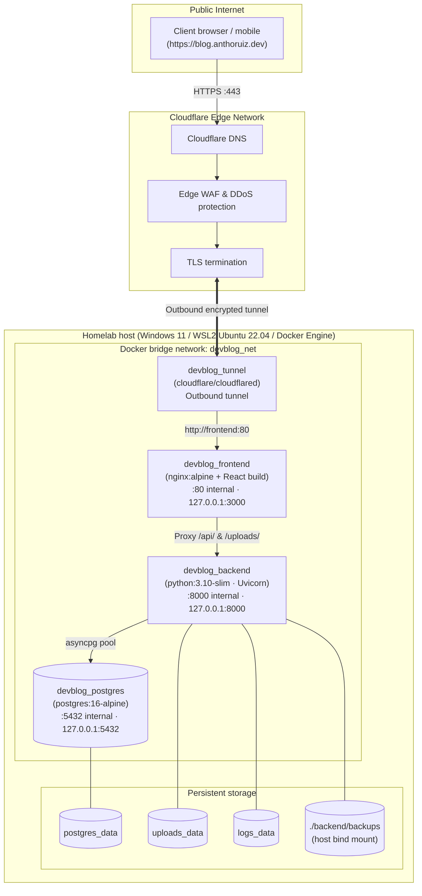
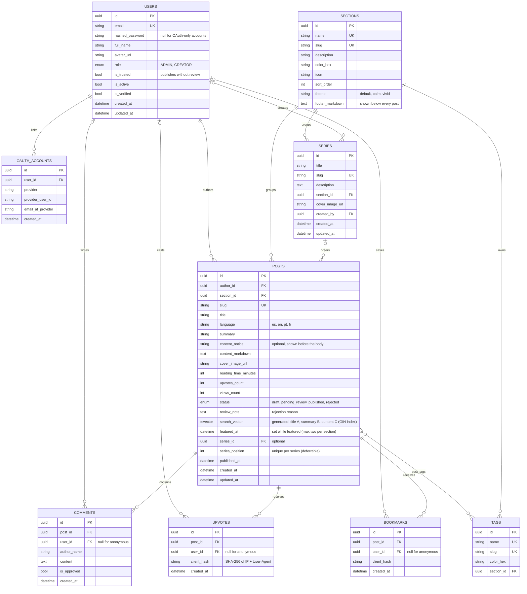

# Anthony Ruiz — Blog • End-to-End Technical Specification & Architecture Manual

> **Document Version:** 4.1.0 (2026-10-01)  
> **Target Audience:** AI agents and developers picking up the project, systems architects, DevOps engineers  
> **Production URL:** `https://blog.anthoruiz.dev`  
> **Local endpoints:** Production stack: frontend `127.0.0.1:3000`, API `127.0.0.1:8000` · Development stack: frontend `localhost:5173`, API `localhost:8001/docs`  
> **Purpose:** single source of truth for the system. A new session (human or AI) should be able to resume development from this file alone; read §0 first.

---

## 0. Start Here (Handoff Summary)

### 0.1 What this is
The personal blog of **Anthony Ruiz** (software engineer in security, homelab builder), live at `https://blog.anthoruiz.dev`. It runs on his own homelab (Windows 11 + WSL2 + Docker) behind a Cloudflare Tunnel. The owner is the only `ADMIN`; anyone who signs up becomes a `CREATOR` whose posts go through the admin's review queue. Anonymous visitors are the readers.

Content is organized in five fixed **sections** (Tech & Coding, AI, Interviews & Career, Mental Health, Gaming). Posts can be featured, grouped into **series**, searched with PostgreSQL full-text search, followed by RSS and shared with rich link previews. Mental Health posts are the owner's personal experience, not professional advice; that section has a calm theme and a disclaimer footer.

### 0.2 Current state (2026-10-01)
- **Implementation Plan v2 is complete** (phases A–I, see §10 and `docs/plans/IMPLEMENTATION_PLAN_V2.md`). Everything is deployed to production.
- **Database:** Alembic head `0009_ai_drafts` in production and development.
- **AI drafts:** a daily job writes two drafts at 16:00 Seattle time for the admin to review (§4.12).
- **Production data:** only the admin account and the 19 starter tags; **no posts yet**, so the home shows empty-section states until the owner publishes.
- **Development data:** demo and pagination-test posts (all in Tech & Coding) for local testing.
- **AI:** only a Gemini key is configured in production (no Anthropic key); Claude is wired and takes over automatically if a key is added.
- **Git:** work happens on `main`. The owner pushes to GitHub himself; never push. Commits are authored as the owner (see §11.4).

### 0.3 Where things live
| What | Where |
|---|---|
| Backend (FastAPI) | `backend/app/` — `api/v1/` routers, `models/`, `schemas/`, `services/`, `core/` (config, security, quotas, limiter, logging) |
| Migrations | `backend/migrations/versions/0001…0008` (run automatically on startup) |
| Frontend (React + Vite) | `frontend/src/` — `app/` (router, layout, navbar, shell context), `features/<feature>/` (admin, auth, bookmarks, feed, home, posts, search, series), `shared/` (API client, TanStack Query keys, i18n, UI, utils, types) — see §5.2 |
| End-to-end tests | `frontend/e2e/` (Playwright, run against the dev stack: `npm run test:e2e`) |
| Nginx (production) | `frontend/nginx.conf` (SPA fallback, API proxy, feeds, social-bot previews, security headers) |
| Compose | `docker-compose.yml` (production, project `blog`), `docker-compose.dev.yml` (development, project `devblog-dev`) |
| Deploy script | `deploy.sh` (checks, deploy, post-deploy security verification) |
| Config | `.env` (production), `.env.dev` (development); templates `.env.example`, `.env.dev.example`. Never commit the real files |
| Backups | `backend/backups/` (host bind mount, git-ignored) |
| Docs | `README.md` (overview), this file (full spec), `docs/plans/IMPLEMENTATION_PLAN_V2.md` (plan and decisions, done), `docs/plans/FEAT_RSS_LINKEDIN_SPEC.md` (RSS/OG spec; LinkedIn automation still pending) |
| Personal brand book (outside the repo) | `C:\Users\14076\OneDrive\Desktop\Personal_Brand\Brand Book\brand-book.md` (WSL: `/mnt/c/Users/14076/OneDrive/Desktop/Personal_Brand/Brand Book/`) plus SVG assets. Source of truth for name, tagline, colors, fonts and copy |
| Approved home design | claude.ai design artifact "Blog Home Redesign" (`https://claude.ai/artifact/GrRrM54VekGMX4Dg7aCKuQ`), implemented in `frontend/src/features/home/HomeMagazine.tsx` |

### 0.4 Non-negotiable conventions
1. **English only** for code, comments, identifiers, log/error messages, commit messages, scripts and docs. The owner chats in Spanish; that never leaks into the project. User-facing strings go through `frontend/src/shared/i18n/translations.ts` in **es, en, pt and fr** (Spanish is the default UI language).
2. **Brand book first** for any visual or copy decision (tokens in §5.1).
3. **Every schema change = an Alembic migration**, tested on a copy of production before deploying (§11.2).
4. **Backup before every production deploy**, then `./deploy.sh` and verify (§11.5).
5. **Commit in small steps**: backend, frontend and docs as separate commits within a feature.
6. **Docs move with the code**: update `README.md` and this file in the same change (routes, endpoints, env vars, migrations).
7. **Secrets** only in `.env` files; no defaults for secrets anywhere.
8. **Employer rule** (brand book): "Views are my own" next to any employer mention; never internal details.

### 0.5 Resume in five minutes
```bash
wsl -d Ubuntu                                   # Docker Engine lives inside WSL
cd /mnt/c/Users/14076/OneDrive/Desktop/Blog
git log --oneline -15                           # recent work
docker ps                                       # prod: devblog_*  · dev: devblog_dev_*
docker exec devblog_backend alembic current     # prod migration head
docker exec devblog_dev_backend alembic current # dev migration head

# Development
docker compose -f docker-compose.dev.yml --env-file .env.dev up -d --build
cd frontend && npm install && npm run dev       # see §11.6: Node is the Windows install

# Checks before committing
docker exec devblog_dev_backend alembic check   # models and schema in sync
cd frontend && npx tsc --noEmit -p .            # type check
cd frontend && npm run test:e2e                 # end-to-end suite (dev stack running, see §11.3)
```

---

## 1. Executive Summary & System Philosophy

**Anthony Ruiz — Blog** (blog.anthoruiz.dev) is a self-hosted personal engineering blog and Homelab observability hub. Branding (name, tagline, `>ar_` monogram, tokens, fonts) follows the personal brand book. It runs on consumer hardware (a laptop or mini-PC under Windows 11 + WSL2) and is published worldwide through Cloudflare's edge without opening any router ports.

### Core Architectural Tenets
1. **Edge-routed, zero port forwarding:** no residential router ports (80/443) are opened. All ingress traverses an outbound-only encrypted tunnel (`cloudflared`) to Cloudflare's edge. Every other service listens on `127.0.0.1` only.
2. **Secure by default:** secrets are required (no insecure fallbacks), production refuses to start with weak settings, and admin-only surfaces (telemetry, logs, backups, user management) require the `ADMIN` role.
3. **Role-based access control (RBAC):** two roles (`ADMIN`, `CREATOR`) enforced through FastAPI route dependencies; anonymous visitors are the readers. Every sign-up is a `CREATOR` and only admins change roles. Posts from untrusted creators go through an admin review queue.
4. **Isolated environments:** production and development are separate Docker Compose projects with their own databases, volumes, ports and configuration files.
5. **Autonomous operations:** automatic daily database backups with 7-copy rotation, Docker restart policies, and a deployment script with pre- and post-deploy checks.
6. **AI assistance with failover:** Claude and Google Gemini behind one provider layer for translation, tag suggestions, reading time and tag-section validation. Fallbacks are honest: translation fails loudly without AI; the rest use labelled heuristics.

---

## 2. End-to-End System Topology



---

## 3. Infrastructure & Deployment Specification

### 3.1 Host & Virtualization Layer
- **Hardware:** consumer x86_64 laptop / mini-PC.
- **Operating system:** Windows 11 with WSL2.
- **WSL distribution:** Ubuntu 22.04 LTS with Docker Engine installed **inside WSL**. All Docker commands must run from the `Ubuntu` distribution (`wsl -d Ubuntu`); the Windows Docker CLI (`cmd`, PowerShell, Git Bash) is not connected to this engine.
- **Keep-alive:** keep a `wsl -d Ubuntu sleep infinity` process running on the host so Windows idle/standby does not suspend WSL2 and its network interfaces.

### 3.2 Environments

| | Production | Development |
|---|---|---|
| Compose file / project | `docker-compose.yml` (project `blog`) | `docker-compose.dev.yml` (project `devblog-dev`) |
| Configuration | `.env` | `.env.dev` |
| Containers | `devblog_postgres`, `devblog_backend`, `devblog_frontend`, `devblog_tunnel` | `devblog_dev_postgres`, `devblog_dev_backend` |
| Frontend | Nginx serving the production build · `127.0.0.1:3000` | Vite dev server on the host · `localhost:5173` |
| Backend | Code baked into the image, no reload · `127.0.0.1:8000` | Source mounted, `--reload` · `127.0.0.1:8001` |
| Database | `devblog` · `127.0.0.1:5432` | `devblog_dev` · `127.0.0.1:5433` |
| OpenAPI docs | Disabled | `http://localhost:8001/docs` |
| Seed | 19 starter tags + admin | 19 starter tags + admin + 3 demo posts (plus test posts created while developing) |
| Cloudflare Tunnel | Yes | No |
| Deploy | `./deploy.sh` | Automatic on save |

The Vite dev server proxies `/api`, `/uploads`, `/feed.xml` and `/<section>/feed.xml` to the development backend (`VITE_API_PROXY_TARGET`, default `http://localhost:8001`) — never to production.

### 3.3 Production Container Orchestration (`docker-compose.yml`)

| Container | Service | Image | Internal port | Host binding | Purpose |
|---|---|---|---|---|---|
| `devblog_postgres` | `db` | `postgres:16-alpine` | `5432` | `127.0.0.1:${POSTGRES_PORT}` | Relational persistence with `pg_isready` healthcheck |
| `devblog_backend` | `backend` | Custom (`python:3.10-slim`) | `8000` | `127.0.0.1:8000` | FastAPI API, AI providers (Claude/Gemini), backups, telemetry |
| `devblog_frontend` | `frontend` | Multi-stage (`node:20-alpine` → `nginx:alpine`) | `80` | `127.0.0.1:3000` | Nginx reverse proxy and React SPA |
| `devblog_tunnel` | `tunnel` | `cloudflare/cloudflared:latest` | — | — | Outbound edge tunnel connector |

**Configuration contract:** required values use `${VAR:?message}` interpolation, so Compose aborts with a clear error instead of falling back to a default. Required: `POSTGRES_USER`, `POSTGRES_PASSWORD`, `POSTGRES_DB`, `SECRET_KEY`, `ENVIRONMENT`, `CLOUDFLARE_TUNNEL_TOKEN`. Optional settings only default to their safe value (`DEBUG=False`, `ALLOW_ROLE_SELF_SWITCH=False`).

**Volumes:** `postgres_data`, `uploads_data` and `logs_data` are named volumes; `./backend/backups` is bind-mounted so snapshots are visible on the host. `backend/.dockerignore` keeps backups, uploads, logs and `.env*` out of the image.

### 3.4 Deployment (`deploy.sh`)
`./deploy.sh [service...] [--check] [--yes]`, run from WSL:
1. **Environment:** Linux/WSL with a reachable Docker engine; warns if a `docker-compose.override.yml` would be auto-applied.
2. **Configuration:** `.env` must define `SECRET_KEY` (≥ 32 chars), `CLOUDFLARE_TUNNEL_TOKEN`, `POSTGRES_PASSWORD` and `ENVIRONMENT=production`; refuses `ALLOW_ROLE_SELF_SWITCH=True`; runs `docker compose config` to catch unresolved variables.
3. **Git state:** shows branch/commit and lists uncommitted changes under `backend/`, `frontend/` or `docker-compose.yml` (ignoring CRLF-only differences), asking for confirmation.
4. **Deploy:** `docker compose up -d --build --remove-orphans`.
5. **Verification:** all 4 containers running, backend `/health` (up to 60 s), no `--reload`, public site and API respond, and `/api/v1/logs/recent`, `/api/v1/stats/telemetry` and `/api/v1/stats/status` return `401` without a session.

`--check` runs steps 1–3 and 5 without deploying.

### 3.5 Network Ingress & Cloudflare Tunnel
1. **Connector:** `cloudflared tunnel --no-autoupdate run --token ${CLOUDFLARE_TUNNEL_TOKEN}`.
2. **Public hostname:** `blog.anthoruiz.dev` → origin `http://frontend:80` (configured in Cloudflare Zero Trust; unmatched hostnames return 404).
3. **Nginx (`frontend/nginx.conf`):**
   - **Real client IP:** `set_real_ip_from 172.16.0.0/12` + `real_ip_header CF-Connecting-IP`, so `$remote_addr` is the visitor rather than the tunnel container.
   - **Rate limiting:** leaky bucket at `30 r/s` per visitor with `burst=50` (`zone=api_gateway_limit:10m`), HTTP 429 on exhaustion.
   - **Security headers:** `X-Content-Type-Options: nosniff`, `X-Frame-Options: DENY`, `Referrer-Policy: strict-origin-when-cross-origin`, `Permissions-Policy` (camera/microphone/geolocation off); `server_tokens off`.
   - **SPA fallback:** `try_files $uri $uri/ /index.html`.
   - **Social previews:** a `map` on `$http_user_agent` flags social bots (LinkedIn, X, Facebook, Slack, Discord, WhatsApp, Telegram, Mastodon, Bluesky, Reddit, Embedly); `location /posts/` sends them (via `error_page 418` to a named location) to `/api/v1/share/posts/<slug>`, everyone else gets `index.html`.
   - **Feeds:** `location = /feed.xml` → `/api/v1/feed.xml`; `location ~ ^/[a-z0-9-]+/feed\.xml$` rewrites to `/api/v1/sections/<slug>/feed.xml` (rewrite + `proxy_pass` without URI, so no resolver is needed).
   - **API proxy:** `/api/` → `backend:8000/api/`, `client_max_body_size 16m` for uploads.
   - **Uploads:** `/uploads/` → backend, cached 30 days, served with `nosniff` and `Content-Security-Policy: default-src 'none'; img-src 'self'; style-src 'unsafe-inline'; sandbox`.
   - **gzip** for text, CSS, JSON, JavaScript and XML.

---

## 4. Backend Architecture (FastAPI & Python 3.10)

### 4.1 Technology Stack
- **Framework:** FastAPI `0.110` on Uvicorn `0.28` (ASGI).
- **ORM & driver:** SQLAlchemy `2.0` async with `asyncpg`.
- **Migrations:** Alembic (`backend/alembic.ini`, `backend/migrations/`), applied automatically on startup by `app/db/migrations.py` (see 4.9).
- **Validation & settings:** Pydantic `2.6` and `pydantic-settings`.
- **Security:** `passlib[bcrypt]` for password hashing, `python-jose` for JWT (HS256, 24 h expiry).
- **Rate limiting:** SlowAPI (in-memory, keyed by `CF-Connecting-IP` / `X-Forwarded-For` / peer address).
- **Monitoring:** `psutil` for host telemetry.
- **AI SDKs / HTTP:** official `anthropic` SDK (1.9, async) for Claude; `httpx` for Gemini and Google token verification.

### 4.2 Configuration (`backend/app/core/config.py`)
- `DATABASE_URL` is built from `POSTGRES_USER/PASSWORD/HOST/PORT/DB` with the user and password **percent-encoded**, so passwords may contain `@ : / # %`. A full `DATABASE_URL` can be supplied instead.
- `SECRET_KEY` has no default; startup fails without it.
- **Production guard:** with `ENVIRONMENT=production` the app raises at startup if `SECRET_KEY` is a published default or shorter than 32 characters, or if `ALLOW_ROLE_SELF_SWITCH` is enabled. In development it only prints a warning.
- OpenAPI (`/api/v1/openapi.json`, `/docs`, `/redoc`) is disabled in production.

### 4.3 Database Schema & Entity Relationships

All primary keys are UUIDs.



### 4.4 Sections
Every post and every tag belongs to exactly one section (`section_id`, required, `ON DELETE RESTRICT`). The five sections are created by migration `0003_add_sections`:

| Section | Slug | Color | Icon key |
|---|---|---|---|
| Tech & Coding | `tech` | `#22d3ee` | `code` |
| AI | `ai` | `#a78bfa` | `cpu` |
| Interviews & Career | `career` | `#fb923c` | `target` |
| Mental Health | `mental-health` | `#f472b6` | `heart` |
| Gaming | `gaming` | `#4ade80` | `gamepad` |

Admins can edit name, description, color, `theme` and `footer_markdown` (`PUT /admin/sections/{id}`, admin panel → Sections). Slugs are fixed because they are URLs (`/tech`), and there is no endpoint to create or delete sections: a new section needs a migration (and must not use a reserved slug, §5.3). Mental Health is seeded with `theme=calm` and a disclaimer footer by migration `0008`.

**Tag-section validation (`backend/app/services/tag_classifier.py`).** A new tag must fit its section ("WoW" belongs to Gaming, never Tech & Coding):
- With an AI provider configured, the LLM layer (4.11) classifies the name against the section names and descriptions and returns `{section_slug, confidence, reason}` (the slug is an enum of the sections plus `none`). Without a provider, or when all fail, a keyword classifier is used (games, consoles, engines, mental-health, interview and AI terms; short keywords match whole words only).
- A tag is rejected only when another section is suggested with confidence ≥ 0.7. Ambiguous or unknown names return no suggestion and never block. Results are cached in memory.
- The editor calls `POST /posts/tags/validate` while the author types (debounced) and offers "Create in <section>"; `POST /posts/tags` enforces the same rule (HTTP 422) unless an admin sends `force: true`.

### 4.5 Seed Data (`seed_initial_data()` in `backend/app/main.py`)
Runs on every startup (after migrations) and only fills what is missing:
1. **Starter tags** (only when the `tags` table is empty) — 19 tags from `DEFAULT_TAGS`, each with its section:
   - *Technology:* Software Engineering, Python, JavaScript & TypeScript, React, Backend & APIs, Databases, Distributed Systems, Cloud & DevOps, Docker & Homelab, Security, AI & Machine Learning
   - *Career & interviews:* Interview Prep, System Design, Algorithms & Data Structures, Career Growth
   - *Wellbeing:* Mental Health, Productivity & Habits
   - *Gaming:* Video Games, Game Development
2. **Admin user** (only when no `ADMIN` exists) — created from `ADMIN_EMAIL` / `ADMIN_PASSWORD`. Without a password, a random one is generated and printed once to stdout (never to `server.log`). Existing admins still using the legacy default password are rotated to `ADMIN_PASSWORD` or reported with a warning.
3. **Demo posts** (only when `SEED_DEMO_POSTS=True` and there are no posts) — three English posts with Unsplash covers in Tech & Coding. Enabled in development, disabled in production.

### 4.6 Security & Role-Based Access Control

| Role | Capabilities |
|---|---|
| Anonymous visitor | Read published posts, upvote, bookmark and comment |
| **`ADMIN`** | Everything a creator can do, on any post, publishing directly · review queue (approve, or reject with a reason) · list users, change roles and mark creators as trusted (the last admin can never be demoted) · create, download and delete backups · inspect media storage and clean up orphaned uploads · hardware telemetry and system status · recent server logs |
| **`CREATOR`** | Write posts (drafts, submit for review) · edit and delete **own** posts · upload images (20/day) · create tags · AI translation, tag suggestions and reading-time estimates (30/day) |

Every sign-up (email or Google) is a `CREATOR`; the admin account comes from `ADMIN_EMAIL`/`ADMIN_PASSWORD` at startup.

**Post lifecycle (`posts.status`):** `draft` → `pending_review` → `published`, or `rejected` with a `review_note` the author sees; a rejected post can be edited and submitted again. `submit=true` publishes directly for admins and trusted creators and sends the post to review otherwise; `submit=false` keeps it as a draft. When an untrusted creator edits a published post it goes back to review. Unpublished posts are visible only to their author and admins, and readers can only interact with published posts.

**Daily quotas (`app/core/quotas.py`):** per-user, in-memory counters that reset at UTC midnight (and on restart): AI calls 30/day, image uploads 20/day, real-time tag checks 200/day. Admins are exempt. Exceeding a quota returns `429`.

**Review alerts:** there is no email; admins see the pending count (`GET /admin/review/count`) as a badge on the navbar's account button (and on *Admin panel* inside its menu) and as a `(N)` prefix in the tab title. It is polled every 60 s (also in background tabs) and refreshed when the tab regains focus. `PUT /auth/me/role` (self role switch) returns `403` unless `ALLOW_ROLE_SELF_SWITCH=True`, which is meant for local testing only.

**Route dependencies (`backend/app/api/deps.py`):**
- `get_current_user_optional` — decodes the Bearer JWT if present, otherwise `None`.
- `get_current_user` — requires a valid token (`401`).
- `get_current_creator_or_admin` — requires `CREATOR` or `ADMIN` (`403`).
- `get_current_admin` — requires `ADMIN` (`403`).
- `get_client_hash` — SHA-256 of IP + User-Agent for anonymous upvotes/bookmarks.

**Additional controls:**
- **Google sign-in endpoint:** tokens verified via Google `tokeninfo` and required to match `GOOGLE_CLIENT_ID` (`aud`), a Google issuer, and `email_verified`; returns `503` while no client ID is configured.
- **Uploads:** content detected by magic bytes (JPG, PNG, GIF, WEBP; SVG rejected), 5 MB cap (15 MB for GIF), random filenames.
- **Comments:** honeypot field `hp_website`, script/iframe stripping, length limits; rendered as plain text in the UI.
- **Client log intake:** fields truncated and newlines neutralized so clients cannot forge log lines.

**Rate limits (SlowAPI, per client IP):**

| Endpoint | Limit |
|---|---|
| `POST /auth/register` | 5/min |
| `POST /auth/login`, `POST /auth/oauth/google` | 10/min |
| `POST /posts/ai-suggest-tags`, `POST /posts/ai-translate` | 10/min |
| `POST /posts/{post_id}/comments` | 5/min |
| `POST /posts/{post_id}/upvote` | 30/min |
| `POST /logs/client` | 20/min |

### 4.7 Local Media Storage (`backend/app/services/media_service.py`)
- **Location:** `/app/uploads` (Docker volume `uploads_data`), served by Nginx and FastAPI at `/uploads/<file>`. Posts store only the URL (`cover_image_url`, or `` inside `content_markdown`).
- **Upload pipeline (`POST /posts/upload-image`):** read at most 15 MB + 1 byte, detect the type by magic bytes, apply the per-type limit (5 MB JPG/PNG/WEBP, 15 MB GIF), store as `img_<12 hex>.<ext>`.
- **Orphan detection:** a file is orphaned when it matches the uploader's naming pattern, no post (published or draft) references it in its cover or markdown (relative or absolute `/uploads/` URL), and it is older than 24 h (grace period for posts still being written). Other files in the directory are never touched.
- **Cleanup:** `cleanup_orphans()` runs daily right after a successful backup, and on demand via `POST /admin/media/cleanup`.

### 4.8 Automated Backup Engine (`backend/app/services/backup_service.py`)
- **Scheduler:** background task started in the FastAPI `lifespan`, running every 24 h: backup first, then orphan cleanup (only if the backup succeeded).
- **Snapshot pair:** `pg_dump --clean --if-exists` gzip-compressed to `backup_devblog_YYYYMMDD_HHMMSS.sql.gz`, plus `backup_devblog_YYYYMMDD_HHMMSS.media.tar.gz` with every uploaded file (built in a worker thread, written atomically). Stored in `/app/backups` (host: `backend/backups/`).
- **Retention:** keeps the 7 most recent pairs; rotation and deletion always remove both files. Backups predating media archiving are listed without a media archive.
- **Safety:** filenames are validated against path traversal; all endpoints are admin-only.

### 4.9 Database Migrations (Alembic)
- `0001_baseline` — the schema as of the Alembic introduction (autogenerated from the models).
- `0002_reconcile_legacy` — idempotent fixes for databases created by older versions with `create_all` (nullable `bookmarks.user_id`, anonymous-bookmark index and unique constraint, no server default on `posts.language`). No-op on a database built from the baseline.
- `0003_add_sections` — sections table plus `section_id` on tags and posts, with data backfill.
- `0004_roles_and_review` — roles become `ADMIN`/`CREATOR` (`AUTHOR`→`CREATOR`, `READER` accounts→`CREATOR`; the enum is rebuilt because Postgres cannot drop enum values), `users.is_trusted`, `posts.status` (backfilled from `is_published`, which is dropped) and `posts.review_note`.
- `0005_post_search` — `posts.search_vector`, a **stored generated** `tsvector` (title A, summary B, content C, `simple` config) with a GIN index. The model declares it with `Computed(...)`; `alembic check` prints a harmless "Computed default cannot be modified" warning.
- `0006_featured_posts` — `posts.featured_at` (indexed).
- `0007_series` — `series` table, `posts.series_id`/`series_position` and the **deferrable** unique constraint `uq_posts_series_position` (lets a reorder swap positions inside one transaction).
- `0009_ai_drafts` — `posts.origin`, `posts.ai_meta`, `posts.cover_credit`, the `ai_writer_settings` row and the `ai_draft_runs` log (partial unique index: one scheduled run per day).
- `0008_section_personality` — `sections.theme`, `sections.footer_markdown` (Mental Health seeded calm + disclaimer) and `posts.content_notice`.
- **Startup:** `run_migrations()` runs in a worker thread before seeding. A database that has the app tables but no `alembic_version` (created before Alembic) is stamped at `0001_baseline` first, so its data is kept and only later migrations run.
- **New migration:** change the models, then `docker exec -w /app devblog_dev_backend alembic revision --autogenerate -m "<message>"` (or write it by hand following the `000N_<name>.py` naming and `revision`/`down_revision` chain), review the file (add data backfills by hand, write a real `downgrade()`), and let the dev backend apply it (it reloads on save and migrates on startup; `alembic upgrade head` also works). `alembic check` must report "No new upgrade operations detected". Then test it on a copy of production (§11.2).
- **Model gotchas learned the hard way:** a `Mapped[datetime]` (non-optional) column is `NOT NULL`, so the migration must say `nullable=False` or `alembic check` fails; and a SQLAlchemy relationship must not share its name with a field of the Pydantic response schema built from that model (`Post.parent_series` exists because `PostDetailRead.series` is computed data; with both named `series`, Pydantic triggers a lazy load and async SQLAlchemy raises `MissingGreenlet`).

### 4.10 Observability & Hardware Telemetry
- **Logging:** rotating file handler at `/app/logs/server.log` (5 MB × 3) plus stdout; client errors are logged through the `devblog.client` logger.
- **Telemetry (`GET /stats/telemetry`, admin):** CPU % (`psutil.cpu_percent`), logical/physical cores, RAM, disk, uptime (`psutil.boot_time`) and temperature (`psutil.sensors_temperatures`, estimated from CPU load when no sensor is exposed, as under WSL2).
- **System status (`GET /stats/status`, admin):** measures a real `SELECT 1` round-trip to PostgreSQL and reports FastAPI, Nginx and the configured AI providers (`degraded` when none) alongside the hardware snapshot. AI providers are not pinged, to avoid spending tokens on every refresh.
- **Public liveness:** `GET /stats/system` and `GET /health` return static healthy responses without host details.

---

### 4.11 AI Providers (`backend/app/services/llm.py`, `ai_features.py`)
- **One entry point:** `generate_json(prompt, schema, task=..., max_tokens, timeout, effort, stream)` returns a JSON object matching the schema plus the provider that produced it (e.g. `claude:claude-opus-5-5`).
- **Failover:** providers are tried in `LLM_PROVIDER_ORDER` (default `claude,gemini`), skipping those without an API key. Any exception, timeout, refusal, `max_tokens` truncation or JSON missing required keys moves on to the next provider; when all fail, `LLMUnavailable` is raised with a `reason`: `not_configured`, `quota_exhausted` (every provider tried was out of quota: Gemini HTTP 429 `RESOURCE_EXHAUSTED`, Claude 429 or "credit balance too low"; carries the soonest known `retry_after` from `Retry-After` or a `RetryInfo.retryDelay`) or `failed`.
- **Claude:** official SDK (`AsyncAnthropic`, one SDK retry so failover is quick), model `CLAUDE_MODEL` (default `claude-opus-5-5`), structured output via `output_config.format` (`json_schema`), `effort: low` for short tasks and `medium` for translation, streaming for translations, and the server-side refusal fallback (`fallbacks: "default"`, beta `server-side-fallback-2026-07-01`).
- **Gemini:** REST `generateContent` (API key in the `x-goog-api-key` header) with `response_mime_type: application/json`, `responseJsonSchema` (without it Gemini may return a bare list), `thinkingConfig.thinkingLevel: low` and `maxOutputTokens` = task budget + 1024 (thinking tokens count against it). `GEMINI_MODEL` is a list: an overloaded (503), retired (404), empty or out-of-quota (429) model moves on to the next one, and when every model answered 503 the list is retried once after 2 s; free-tier quotas are per model, so the list also stretches the quota. The provider only reports `quota_exhausted` when every listed model is out of quota.
- **Features and their non-AI behaviour:**

| Feature | Timeout | Without a working provider |
|---|---|---|
| Translation (`POST /posts/ai-translate`) | 180 s, streamed | No fake translation: HTTP 429 + `Retry-After` when the quota is exhausted, 503 otherwise; `detail = {code, message, retry_after}` so the editor shows a localized message |
| Tag suggestions (`POST /posts/ai-suggest-tags`) | 40 s | Existing tags / known technologies found in the text; response `provider: "keywords"` plus `fallback_reason`; may be empty |
| Reading time (`POST /posts/ai-estimate-reading-time`) | 30 s | Heuristic: prose 180 wpm, code ~20 lines/min, density factor. Post create/update always use the heuristic so publishing never waits on an LLM |
| Tag-section validation | 25 s | Keyword classifier (4.4); only LLM answers are cached |

- `GET /posts/ai-status` tells the editor whether AI is available; the editor then disables translation and labels keyword suggestions.

### 4.12 Daily AI drafts (`services/ai_writer.py`, `topic_feeds.py`, `unsplash.py`, `api/v1/ai_drafts.py`)
- **What:** every day at `AI_DRAFTS_TIME` (default `16:00`) in `AI_DRAFTS_TIMEZONE` (default `America/Los_Angeles`) the backend writes **two drafts on different topics**, one in English and one in Spanish (assigned at random), from the eligible sections. **Mental Health is always excluded** (personal experience only). Drafts are `pending_review` posts with `origin="ai"` by the **AI Writer** account (`AI_WRITER_EMAIL`, inactive, no password: it can never sign in).
- **Scheduler:** an asyncio task started in the app lifespan (like the backup job). It sleeps until the next run; on startup it runs today's job if the time has passed and no scheduled run exists (missed while the app was down). `ai_draft_runs` records every run (`schedule`, `retry`, `manual`) and a partial unique index allows one scheduled run per day, so restarts or several workers never duplicate it. A failed run is retried once after 30 minutes. Generation stops while `max_pending` (default 6) AI drafts wait for review. An in-process lock serializes runs and regenerations.
- **Sections:** least recently drafted first, ties at random; the eligible list lives in `ai_writer_settings.sections` (default tech, ai, career, gaming).
- **Research:** first `llm.research_with_search()` (Claude `web_search_20260209` tool, or Gemini Google Search grounding). **Gemini grounding is not available on the free tier**, so with only a free Gemini key it fails fast and the writer falls back to `topic_feeds.research_from_feeds()`: recent stories from Hacker News (Algolia API) and DEV.to filtered by section keywords and the last 30 days; the LLM picks one with a normal call and the chosen articles' text (fetched and stripped to paragraphs) becomes the research notes. Sources are fetched to verify they open (redirects resolved), up to six, and appended as a *Sources/Fuentes* section.
- **Writing:** `generate_json` with a schema (title, summary, markdown, tags from the section, Unsplash query, editor notes in Spanish). The prompt applies the brand voice, presents other people's work in third person (never "I built/used" about the research), and marks places for the owner's experience with `> TODO:` blockquotes.
- **Covers:** Unsplash search (`UNSPLASH_ACCESS_KEY`, only the Access Key), landscape, a photo not used before; the image is hotlinked, the photographer is credited under the cover (`posts.cover_credit`) and the photo's `download_location` is pinged, as the Unsplash API guidelines require. Changing the cover in the editor drops the credit.
- **Adoption:** approving an AI draft (`POST /admin/posts/{id}/approve`) or publishing it from the editor sets the admin as author ("publish as mine"); saving it keeps it in the AI queue; rejecting it ("Discard") keeps it for topic deduplication. `origin` stays `ai` internally.
- **Admin endpoints:** `GET /admin/ai-drafts/status`, `PUT /admin/ai-drafts/settings` (`enabled`, `max_pending`, `sections`), `POST /admin/ai-drafts/run` (background, 202), `POST /admin/ai-drafts/{id}/regenerate` (`{note}`, rewrites from the stored research in the background). `GET /admin/review/count` returns `{pending, ai_pending}`.
- **External generators:** `POST /ai-drafts/ingest` with `X-API-Key: AI_DRAFTS_API_KEY` accepts a finished draft (n8n, scheduled agents…); disabled (404) when the key is unset. Development sets a key for the e2e tests.
- **Logs:** `devblog.ai_drafts` in `server.log`; the admin tab shows the last runs.

## 5. Frontend Architecture (React 18, TypeScript & Vite)

### 5.1 Technology Stack
- **Framework:** React 18 (function components and hooks).
- **Language:** TypeScript 5 (strict).
- **Bundler / dev server:** Vite 5.
- **Styling:** Tailwind CSS 3, dark only, using the brand book tokens: background `#07090E`, surface `#0B0F19`, surface-2 `#121622`, border `#1E293B`, strong border `#475569`, text `#F8FAFC` / `#94A3B8` / `#7C8AA0` (never `#64748B`, it fails WCAG AA), accent `#22D3EE` (hover `#67E8F9`). Fonts: Inter (people's text) and JetBrains Mono (machine text: tags, dates, metrics, eyebrows), loaded from Google Fonts in `index.html`. Older components still use Tailwind's `slate`/`cyan` utilities; new code uses the hex tokens. Section-theme CSS lives in `src/index.css`.
- **Code highlighting:** highlight.js.
- **Diagrams:** Mermaid 12 (dark theme, `securityLevel: 'strict'`).
- **Icons:** lucide-react.
- **Routing:** React Router 6 data router (`createBrowserRouter` in `src/app/router.tsx`) with a shared layout; Nginx serves `index.html` for unknown paths.
- **Server state:** TanStack Query 5 (cache, pagination with infinite queries, invalidation after changes, polling for the review badge).
- **Client state:** React Context for the session (`AuthProvider`), language (`LanguageProvider`), bookmarks (`BookmarksProvider`) and the layout's modals (`ShellProvider`).
- **HTTP:** native `fetch` wrapped in `src/shared/api/client.ts`.
- **Tests:** Playwright end-to-end suite in `frontend/e2e/` (§11.3).

### 5.2 Source Structure (feature-based)

Code is grouped by feature; each feature owns its components, hooks and data access, and shares only through `shared/` and the app shell. Business logic lives in hooks; components render.

```
frontend/src/
├── main.tsx                     # Providers (QueryClient, Language, Auth, Bookmarks) + RouterProvider; global error listeners
├── index.css                    # Tailwind layers, section-theme CSS
├── vite-env.d.ts                # Vite env typings (VITE_ENABLE_ROLE_TESTING)
├── app/
│   ├── router.tsx               # Every route (createBrowserRouter), see §5.3
│   ├── Layout.tsx               # Navbar + <Outlet/> (inside ErrorBoundary) + footer + app-wide modals; navbar search; hash redirects
│   ├── ShellContext.tsx         # Editor and sign-in modal state; notifyPostsChanged (query invalidation)
│   └── Navbar.tsx               # Brand, search, ES/EN/PT/FR switch, New post, account menu (My posts, Admin panel, System status, sign out) + review badge
├── features/
│   ├── admin/                   # BackupsModal (admin panel), ReviewQueue, SectionsAdmin, SystemStatusModal, RoleTestingBar, useReviewBadge
│   ├── auth/                    # AuthContext (useAuth: token, user, login/logout, permissions), LoginModal
│   ├── bookmarks/               # BookmarksContext (local cache synced with the API)
│   ├── feed/                    # FeedPage, useFeed (queries), SectionBar, TagFilterBar, SortSelect, FeedBanners,
│   │                            #   SectionBands (header, featured, series), PostGrid, FeedPostCard
│   ├── home/                    # HomeMagazine (/ lead story, latest, section blocks, browse by tag)
│   ├── posts/                   # PostPage, ArticleView, DigestCard, NewPostModal (editor), MarkdownToolbar, MyPostsModal, usePostActions
│   ├── search/                  # SearchPage (infinite query, highlights)
│   └── series/                  # SeriesPage (progress, reorder/edit/delete)
└── shared/
    ├── api/                     # client.ts (REST calls, ROLE_TESTING_ENABLED), queries.ts (queryClient, useSections, useTags,
    │                            #   useInvalidatePosts), queryKeys.ts, logger.ts (client error reporting)
    ├── i18n/                    # translations.ts (es/en/pt/fr dictionaries), LanguageContext (useLanguage)
    ├── ui/                      # BrandMark, NotFound, MarkdownRenderer, MermaidRenderer, SectionIcon, SiteFooter, ErrorBoundary
    ├── utils/                   # pageTitle (title + "(N)" badge), readPosts (series progress), readingTime
    ├── types.ts                 # Domain models and API contracts
    └── site.ts                  # SITE_NAME, DEFAULT_TITLE
```
`frontend/public/favicon.svg` is the minimal `>ar_` mark from the brand book.

**Data flow.** Pages read server data through TanStack Query hooks (keys in `shared/api/queryKeys.ts`). Everything that depends on posts is keyed under `['posts', …]` or `['series', …]`; after any change (publish, edit, delete, feature, review, series edit) code calls `notifyPostsChanged()` / `useInvalidatePosts()`, which invalidates posts, series, sections, tags and the review count, so every visible page refreshes. Do not add manual refresh counters.

**Adding a feature.** Create `features/<name>/` with its page/components and hooks; add the route in `app/router.tsx` (and the table in §5.3); put query keys in `queryKeys.ts`; put strings in `translations.ts` (4 languages); add or extend an e2e spec.

### 5.3 Routes

The URL is the source of truth for the page and the feed filters (`app/router.tsx`, `features/feed/FeedPage.tsx`):

| Path | Page |
|---|---|
| `/` | Magazine home: lead story (most recently featured, else latest) with a *Latest* column, one block per section (lead + two more + *View all*), *Browse by tag*, then *All posts* with sort and Load more |
| `/:section` | Section feed (`tech`, `ai`, `career`, `mental-health`, `gaming`) with a *Featured* band (up to two posts) and its series above the rest; `?tag=` filters by a tag of that section |
| `/tags/:tag` | Tag feed across sections |
| `/posts/:slug` | Post page (canonical post URL, used by feeds and previews) |
| `/series/:slug` | Series page: ordered posts, reading progress (stored in the browser), reorder/edit/delete for its owner |
| `/bookmarks` | Saved posts |
| `/admin/status`, `/admin/backups` | Admin modals over the feed (old `#/status` and `#/backups` links redirect here) |
| `/search?q=&section=` | Full-text search results with highlighted matches; typing in the navbar opens it, scoped to the section being browsed |

Unknown paths and unknown section slugs render the client-side 404 page. Section slugs are fixed and must never be `posts`, `tags`, `bookmarks`, `admin`, `search` or `series`.

**How routing is implemented:** `createBrowserRouter` in `app/router.tsx` declares every route under the `Layout` element; pages read their params with `useParams()`. Static segments outrank `:sectionSlug`, which is why section slugs cannot be reserved words. The feed routes (`/`, `/:sectionSlug`, `/tags/:tagSlug`, `/bookmarks`, `/admin/:panel`) all render `FeedPage`, which derives its filters from the URL; changing a filter navigates. Admin modals are routes (`/admin/status`, `/admin/backups`) rendered by the layout over the feed; they remember where they were opened from (`location.state.from`). Each page sets its own tab title through `shared/utils/pageTitle.ts`.

### 5.4 Key UI Behaviour

#### Section personality (`ArticleView.tsx`, `index.css`)
- The post page takes its section's `theme`: **calm** (Mental Health) uses a softer palette, larger line height, sans-serif metadata and no neon markers; **vivid** tints headings and quotes with the section color.
- `posts.content_notice` shows a dismissible notice before the body; `sections.footer_markdown` is rendered below every post of the section. Mental Health starts with a personal-experience disclaimer pointing to findahelpline.com (editable in the admin Sections tab).

#### Header (`app/Navbar.tsx`)
- Follows the brand book nav: `>ar_` mark + name on the left, search in the middle (its own row below `md`), and on the right only a compact mono language switch, the primary **New post** button (icon only on phones) and an **account button** (initials). Visitors see **Sign in** instead of the last two.
- The account button opens a menu (closes on outside click and Escape) with the user's name, email and role, **My posts**, and for admins **Admin panel** (with the pending-review count) and **System status**; the testing role switch (when enabled) and **Sign out** close it. The pending count also shows as a badge on the account button.

#### AI drafts (`features/admin/AIDraftsTab.tsx`)
- Admins see AI drafts as a violet badge on **AI drafts** in the account menu (the account button badge counts everything pending) and a dismissible banner under the header ("You have N AI drafts waiting…" → **Review**). Both open `/admin/backups?tab=ai`.
- The tab shows the schedule, next run, pause/resume, **Generate now**, the recent runs, and each draft with cover, language, section, topic, **notes for you**, the sources it used, and **Preview**, **Edit**, **Approve & publish as mine**, **New version** (feedback note) and **Discard**. It polls while a generation or rewrite is running. The human review tab no longer lists AI drafts.
- Post pages show the Unsplash credit ("Photo by … on Unsplash") under the cover when a post has one.

#### My posts (`features/posts/MyPostsModal.tsx`)
- The signed-in user's posts as mini cards (cover or section-colored placeholder, status badge, section, date or rejection reason, *Edit* and *View*), with status filter tabs showing counts (All, Draft, In review, Published, Rejected) and pagination of 6 per page (page numbers with gaps on wider screens, `n / total` on phones). Data comes from the `['posts', 'mine']` query, so it refreshes after any post change.

#### Public home without telemetry
- The public home shows no telemetry or statistics; hardware data lives only in the admin `/status` modal (`/stats/telemetry`, `/stats/status`). Signed-in users get **New post** and the account menu in the header.

#### Markdown rendering (`MarkdownRenderer.tsx`)
- In-house parser for headings, lists, quotes, tables, inline formatting and fenced code (highlight.js), with ` ```mermaid ` blocks delegated to `MermaidRenderer`.
- All text is HTML-escaped (including quotes). Images and links are extracted before other inline formatting. Links only allow `http(s)`, `mailto` and relative URLs (anything else becomes `#`); images only allow `http(s)` and same-origin paths such as `/uploads/...` (anything else, including protocol-relative and `data:` URLs, is dropped).

#### Inline image upload (`MarkdownToolbar.tsx`)
- The image button uploads through `POST /posts/upload-image` and inserts `` as its own paragraph at the cursor, reading the live textarea value so text typed during the upload is kept.

#### Feed pagination (`features/feed/useFeed.ts`)
- The feed is a TanStack infinite query loading 12 posts per page (`POSTS_PAGE_SIZE`). **Load more** fetches the next page (`offset` = posts loaded so far) and pages are flattened and deduplicated by id; a counter shows `Showing X of Y posts`.
- Section, tag and sort are part of the query key, so a filter change starts a fresh first page and late responses never mix with the new filter. Search is its own page (`/search`), not a feed filter.
- On section pages without a tag filter the grid requests `featured=false`, because featured posts are already shown in the *Featured* band above it.
- Ordering always ends with `Post.id` as a tie-breaker, so page boundaries are stable when dates or votes are equal.

#### Compact tag filter bar (`features/feed/TagFilterBar.tsx`)
- Shown on section, tag and bookmarks pages (not on the magazine home, which has *Browse by tag* and its own *All posts* header with sort and a bookmarks link). Shows `All`, `Bookmarks (N)` and the first 6 tags of the current section (`PRIMARY_TAG_LIMIT`); the rest live in a searchable `+N more` dropdown. A tag picked from the dropdown is pinned to the bar with a remove button.

#### Editor (`NewPostModal.tsx`)
- Title, summary, optional content notice, section (required), optional series of that section (pick one of yours or create one inline), cover upload, tags with real-time section validation, markdown with toolbar and preview, AI translate / tag suggestions / reading time.
- Buttons: **Save draft** (`submit=false`) and **Publish** (admins, trusted creators) or **Submit for review** (other creators). Rejected posts show the admin's reason; pending posts show a notice.

#### Admin panel (`BackupsModal.tsx`, route `/admin/backups`)
- Tabs: **Review (N)** (default; approve, reject with a reason, preview opens the post page), **Users & roles** (role select, *Trusted* checkbox for creators, self role switch only in testing mode), **Backups** (create, download, delete, media usage and orphan cleanup) and **Sections** (name, description, color, theme, footer). The panel's own labels are English only (admin-facing).

#### Admin features on public pages
- A star on each post card features/unfeatures it (max two per section; the API's 409 message is shown). Pending-review count: badge on the account button and the *Admin panel* menu item + `(N)` tab title, polled every 60 s.

#### Role testing switcher
- Hidden unless the frontend is built with `VITE_ENABLE_ROLE_TESTING=true` **and** the backend allows `ALLOW_ROLE_SELF_SWITCH=True`. Switches the signed-in user between `ADMIN` and `CREATOR` (development only).

#### Internationalization (`src/shared/i18n/`)
- Typed dictionaries for 🇪🇸 `es` (default), 🇺🇸 `en`, 🇧🇷 `pt` and 🇫🇷 `fr`, switched instantly from the navbar. The active language is kept in React state (not persisted).

#### Local storage
- `auth_token`, `current_user`, `user_email` (session), `devblog_bookmarks` (offline bookmark cache) and `read_posts` (ids of opened posts, for series progress; max 500).
- `fetchPostBySlug` and `fetchSeriesBySlug` send the token when present, so authors and admins can open their unpublished posts and drafts in a series.

---

## 6. API Specification (REST Contract)

Base URL: `https://blog.anthoruiz.dev/api/v1` (production) · `http://localhost:8001/api/v1` (development; interactive docs at `/docs`).

Auth legend: **Public** — no token · **Optional** — token used if present · **Bearer** — any signed-in user · **Creator** — `CREATOR` or `ADMIN` · **Admin** — `ADMIN` only.

### 6.1 Authentication & Users
| Method | Endpoint | Auth | Description |
|---|---|---|---|
| `POST` | `/auth/register` | Public | Create a `CREATOR` account; returns a JWT |
| `POST` | `/auth/login` | Public | Email/password sign-in; returns a JWT |
| `POST` | `/auth/oauth/google` | Public | Google ID-token sign-in (requires `GOOGLE_CLIENT_ID`) |
| `GET` | `/auth/me` | Bearer | Current user profile and role |
| `PUT` | `/auth/me/role` | Bearer | Self role switch — `403` unless `ALLOW_ROLE_SELF_SWITCH=True` |
| `GET` | `/auth/users` | Admin | List users |
| `PUT` | `/auth/users/{user_id}/role` | Admin | Change a user's role (the last admin cannot be demoted) |
| `PUT` | `/auth/users/{user_id}/trusted` | Admin | Let a creator publish without review (`{is_trusted}`) |

### 6.2 Posts & Tags
| Method | Endpoint | Auth | Description |
|---|---|---|---|
| `GET` | `/posts` | Public | Paginated published posts (`section`, `tag`, `featured=true\|false`, `q` (full-text, prefix-aware), `sort=recent\|top_voted\|trending\|relevance`, `limit` 1–100 default 12, `offset`); returns `{items, total, limit, offset, has_more}` |
| `GET` | `/posts/home` | Public | Magazine home data in one call: `featured`, `latest` (4), and per section `lead` (featured, else latest) + `rest` (2) with post counts |
| `GET` | `/posts/mine` | Creator | The current user's posts in every status |
| `GET` | `/posts/{slug}` | Optional | Post detail (increments views); unpublished posts only for their author and admins |
| `POST` | `/posts` | Creator | Create a post (`section_id` required; `submit` publishes or sends to review, `false` saves a draft) |
| `PUT` | `/posts/{post_id}` | Creator | Update a post (owner or admin) |
| `DELETE` | `/posts/{post_id}` | Creator | Delete a post (owner or admin) |
| `POST` | `/posts/upload-image` | Creator | Upload an image (`multipart/form-data`; JPG/PNG/WEBP ≤ 5 MB, GIF ≤ 15 MB) |
| `GET` | `/posts/tags/all` | Public | List all tags |
| `POST` | `/posts/tags` | Creator | Create a tag in a section (`section_id` required; 422 when it clearly belongs to another section, admins may `force`) |
| `POST` | `/posts/tags/validate` | Creator | Real-time check of a new tag name against a section (30/min) |
| `GET` | `/posts/ai-status` | Creator | Configured AI providers in failover order |
| `POST` | `/posts/ai-translate` | Creator | Translate title, summary and markdown (AI; 429 when the quota is exhausted, 503 without a provider) |
| `POST` | `/posts/ai-suggest-tags` | Creator | Suggest tags (AI, or keywords); returns `provider` |
| `POST` | `/posts/ai-estimate-reading-time` | Creator | Estimate reading time (AI, or heuristic) |

### 6.2b Sections
| Method | Endpoint | Auth | Description |
|---|---|---|---|
| `GET` | `/sections` | Public | Sections in display order with published post counts |
| `PUT` | `/admin/sections/{section_id}` | Admin | Edit name, description, color, `theme` (`default`/`calm`/`vivid`) or `footer_markdown` |

### 6.2c Review & Featured
| Method | Endpoint | Auth | Description |
|---|---|---|---|
| `GET` | `/admin/review` | Admin | Posts waiting for review, oldest first, with the author's name |
| `GET` | `/admin/review/count` | Admin | `{pending}` for the admin panel badge |
| `POST` | `/admin/posts/{post_id}/approve` | Admin | Publish a pending post |
| `POST` | `/admin/posts/{post_id}/feature` | Admin | Feature a published post in its section (`409` when the section already has two) |
| `DELETE` | `/admin/posts/{post_id}/feature` | Admin | Unfeature a post |
| `POST` | `/admin/posts/{post_id}/reject` | Admin | Send a pending post back with `{reason}` |

### 6.2d Series
| Method | Endpoint | Auth | Description |
|---|---|---|---|
| `GET` | `/series` | Public | Series with at least one published post (`section` filter), with `post_count` |
| `GET` | `/series/mine` | Creator | Series the user can add posts to (all for admins), with total post count |
| `GET` | `/series/{slug}` | Optional | Series with its posts in order; readers see published posts, the owner and admins all (`can_edit`) |
| `POST` | `/series` | Creator | Create a series in a section |
| `PUT` | `/series/{series_id}` | Creator | Edit title, description or cover (owner or admin); the section only while empty |
| `PUT` | `/series/{series_id}/order` | Creator | Reorder: `post_ids` lists every post, first to last |
| `DELETE` | `/series/{series_id}` | Creator | Delete the series; its posts stay |

Posts take an optional `series_id` on create and update (`null` removes it); a post joins at the end, must share the series' section and the series must belong to the user (any series for admins). Changing a post's section takes it out of its series. `GET /posts/{slug}` returns `series: {slug, title, position, total, prev, next}`, counting published posts only for readers.

### 6.3 Interactions
| Method | Endpoint | Auth | Description |
|---|---|---|---|
| `POST` | `/posts/{post_id}/upvote` | Optional | Toggle upvote (user or anonymous client hash) |
| `POST` | `/posts/{post_id}/bookmark` | Optional | Toggle bookmark |
| `GET` | `/posts/bookmarks/mine` | Optional | Bookmarked posts for the current user/client |
| `GET` | `/posts/{post_id}/comments` | Public | List comments |
| `POST` | `/posts/{post_id}/comments` | Optional | Add a comment (honeypot-protected) |

### 6.3b Feeds & Social Previews
| Method | Endpoint | Auth | Description |
|---|---|---|---|
| `GET` | `/feed.xml` | Public | RSS 2.0 feed: latest 20 published posts (summary + canonical link, tags as `<category>`, cover as `media:content`) |
| `GET` | `/sections/{slug}/feed.xml` | Public | Same feed for one section |
| `GET` | `/share/posts/{slug}` | Public | Minimal HTML with OpenGraph/Twitter tags for a published post (served to social bots by Nginx) |

Nginx serves the feeds at `/feed.xml` and `/<section>/feed.xml`, and answers `/posts/<slug>` from `/share/posts/<slug>` when the `User-Agent` is a social bot (LinkedIn, X, Slack, Discord, WhatsApp, Facebook, Telegram…), so shared links render a card with title, summary and cover. Everyone else gets the SPA. Feeds and previews are cached for 10 minutes and use `SITE_URL` for absolute links.

### 6.4 Stats, Backups & Logs
| Method | Endpoint | Auth | Description |
|---|---|---|---|
| `GET` | `/site` | Public | Site identity (`name`, `tagline`, `description`, canonical `url`) and published post count |
| `GET` | `/stats/system` | Public | Liveness ping |
| `GET` | `/stats/telemetry` | Admin | Live CPU, RAM, disk, temperature and uptime |
| `GET` | `/stats/status` | Admin | Per-service health and latency + hardware snapshot |
| `GET` | `/admin/backups` | Admin | List backups (with paired media archive) and retention policy |
| `POST` | `/admin/backups/create` | Admin | Create a database dump + media archive now |
| `GET` | `/admin/backups/{filename}/download` | Admin | Download a `.sql.gz` dump or `.media.tar.gz` archive |
| `DELETE` | `/admin/backups/{filename}` | Admin | Delete a backup (a dump also deletes its media archive) |
| `GET` | `/admin/media` | Admin | Media storage usage and orphaned files |
| `POST` | `/admin/media/cleanup` | Admin | Delete orphaned uploads now |
| `POST` | `/logs/client` | Public | Client error report (rate limited, sanitized) |
| `GET` | `/logs/recent` | Admin | Tail of `server.log` (`lines=1..1000`, default 100) |

Outside `/api/v1`: `GET /health` (public liveness), `/uploads/*` (uploaded media).

---

## 7. Environment Variables Reference

Production reads `.env`, development reads `.env.dev` (templates: `.env.example`, `.env.dev.example`). Both are git-ignored, as is every `.env.*` variant except the templates.

| Variable | Required | Default | Description |
|---|:---:|---|---|
| `POSTGRES_USER` | ✅ | — | Database user |
| `POSTGRES_PASSWORD` | ✅ | — | Database password (special characters supported) |
| `POSTGRES_DB` | ✅ | — | Database name |
| `POSTGRES_PORT` | | `5432` (dev `5433`) | Host port for Postgres |
| `SECRET_KEY` | ✅ | — | JWT signing key, ≥ 32 characters in production |
| `ENVIRONMENT` | ✅ | — | `production` or `development` |
| `DEBUG` | | `False` (dev `True`) | SQLAlchemy echo / debug output |
| `CLOUDFLARE_TUNNEL_TOKEN` | ✅ prod | — | Cloudflare Tunnel connector token |
| `ADMIN_EMAIL` | | `admin@devblog.local` | Initial admin email |
| `ADMIN_PASSWORD` | | random, printed once | Initial admin password |
| `ALLOW_ROLE_SELF_SWITCH` | | `False` | Enables `PUT /auth/me/role` (testing only; blocked in production) |
| `SEED_DEMO_POSTS` | | `False` (dev `True`) | Seeds the demo posts into an empty database |
| `ANTHROPIC_API_KEY` | | empty | Claude API key for the AI features |
| `CLAUDE_MODEL` | | `claude-opus-5-5` | Claude model |
| `GEMINI_API_KEY` | | empty | Google AI Studio key for the AI features |
| `GEMINI_MODEL` | | `gemini-flash-latest,gemini-flash-lite-latest` | Gemini model(s), comma-separated, tried in order |
| `LLM_PROVIDER_ORDER` | | `claude,gemini` | Failover order of the configured providers |
| `SITE_NAME` / `SITE_TAGLINE` | | `Anthony Ruiz` / brand tagline | Site identity served by `GET /site` |
| `SITE_DESCRIPTION` | | one-line bio | Meta description for feeds and previews |
| `AI_DRAFTS_TIME` / `AI_DRAFTS_TIMEZONE` | | `16:00` / `America/Los_Angeles` | When the daily AI drafts are written |
| `UNSPLASH_ACCESS_KEY` | | empty | Unsplash Access Key for AI draft covers (without it drafts have no cover) |
| `AI_DRAFTS_API_KEY` | | empty | Enables `POST /ai-drafts/ingest` for external generators (dev sets one for the e2e tests) |
| `AI_WRITER_EMAIL` | | `ai-writer@blog.internal` | Account that authors AI drafts |
| `SITE_URL` | | `https://blog.anthoruiz.dev` | Canonical base URL for post links, feeds and previews |
| `BACKEND_PORT` | | `8001` | Dev backend host port (`.env.dev` only) |
| `VITE_API_PROXY_TARGET` | | `http://localhost:8001` | Vite dev proxy target (shell env when running `npm run dev`) |
| `VITE_ENABLE_ROLE_TESTING` | | unset | Shows the role testing UI (frontend build/dev env) |

> `POSTGRES_PASSWORD` is only applied when the database volume is first initialized. To rotate it: `ALTER USER ... WITH PASSWORD ...` in Postgres, then update `.env` and recreate the backend.

---

## 8. Operational Playbook

### 8.1 Production
```bash
wsl -d Ubuntu
cd /mnt/c/Users/14076/OneDrive/Desktop/Blog

./deploy.sh            # build, deploy and verify
./deploy.sh --check    # verify only
docker compose ps
```

### 8.2 Development
```bash
docker compose -f docker-compose.dev.yml --env-file .env.dev up -d --build   # backend + db
cd frontend && npm run dev                                                   # http://localhost:5173
docker compose -f docker-compose.dev.yml --env-file .env.dev down -v         # wipe dev data
```

### 8.3 Logs
```bash
docker compose logs -f                 # production stack
docker logs -f devblog_backend
docker logs --tail 50 devblog_tunnel   # look for "Registered tunnel connection"
docker logs -f devblog_dev_backend     # development backend
```

### 8.4 Backup & Restore
```bash
# Create a backup now (or use the admin panel)
docker exec -w /app devblog_backend python -c "import asyncio; from app.services.backup_service import create_backup; print(asyncio.run(create_backup(keep=7)))"

# Restore the database (the dump drops and recreates objects, replacing current data)
set -a; source <(grep -E '^POSTGRES_(USER|DB)=' .env); set +a
gunzip -c backend/backups/backup_devblog_YYYYMMDD_HHMMSS.sql.gz \
  | docker exec -i devblog_postgres psql -U "$POSTGRES_USER" -d "$POSTGRES_DB"

# Restore uploaded media into the uploads volume
docker exec -i devblog_backend tar xzf - -C /app/uploads < backend/backups/backup_devblog_YYYYMMDD_HHMMSS.media.tar.gz
```
Files that must survive rotation should be renamed so they no longer end in `.sql.gz` (e.g. `*.sql.gz.bak`).

### 8.5 Database Shell
```bash
docker exec -it devblog_postgres psql -U devblog_user -d devblog
docker exec -it devblog_dev_postgres psql -U devblog_dev -d devblog_dev
```

---

## 9. AI Agent Guidance & Ingestion Index

When reading, analyzing or extending this repository:
1. **Language:** all code, comments, messages, commits and docs are in English. User-facing strings belong in `frontend/src/shared/i18n/translations.ts` (es/en/pt/fr). Spanish keywords in `backend/app/services/ai_features.py` are intentional matching data for Spanish-language posts.
2. **Environments:** never point development tooling at production. Use `docker-compose.dev.yml` + `.env.dev`; Vite already proxies to port 8001.
3. **Secrets:** never add defaults for secrets in `docker-compose*.yml` or `config.py`; required values use `${VAR:?...}`. Never commit `.env*` files (other than the templates) or anything in `backend/backups/`.
4. **Routing:** Nginx proxies `/api/` to `backend:8000/api/`, `/feed.xml` and `/<section>/feed.xml` to the feed endpoints, and `/posts/<slug>` for social bots to the preview page; any other path falls back to `index.html` and React Router renders it (see §5.3).
5. **Schema changes:** models live in `backend/app/models/`; every schema change needs an Alembic migration in `backend/migrations/versions/` (autogenerate, then review and add data backfills). Migrations run automatically on startup. Never go back to `create_all`.
6. **Seed data:** starter tags and demo posts are defined in `backend/app/main.py`; anything that must exist in a fresh database belongs there, not only in a live database.
7. **CORS:** add new public hostnames to `BACKEND_CORS_ORIGINS` in `backend/app/core/config.py`.
8. **Deploying:** use `./deploy.sh` from WSL; it refuses unsafe configurations and verifies security regressions after deploying.
9. **OneDrive:** the working copy lives in a OneDrive-synced folder, which has restored stale file versions before and briefly locks `.git/index.lock`. Commit promptly, retry git commands that fail on the lock, and prefer moving the repository outside OneDrive.
10. **Line endings:** files in the working tree are mostly CRLF (Windows editors) while the repository stores LF. Keep a file's existing line endings when editing, and stage CR-stripped content so diffs only show real changes (§11.4). Only `*.sh` is forced to LF by `.gitattributes`.
11. **Frontend structure:** feature folders, hooks for logic, TanStack Query for server data, invalidation instead of manual refreshes (§5.2–5.3). Run the e2e suite after frontend changes.
12. **Before saying something works:** run the checks in §11 (alembic check, type check, build, a browser test for UI changes). Report failures honestly.
13. **Never** push to GitHub, change `.env` secrets, or delete production data without the owner's explicit request; always back up before a deploy.

---

## 10. Project Status, History & Decisions

### 10.1 Timeline
| Date | Milestone |
|---|---|
| 2026-09-26 | Initial FastAPI + React app, Docker Compose, PostgreSQL, JWT auth |
| 2026-09-27/28 | Security hardening (secrets required, production guard, rate limits, upload validation, client-log sanitizing), `deploy.sh`, separate dev/prod stacks, Alembic, everything translated to English, clean production database |
| 2026-09-29/30 | Local media storage hardening (GIF support, orphan cleanup, media in backups), pagination, sections + tags tied to sections with AI validation (Phase 1–2), Claude/Gemini failover with honest fallbacks and quota handling |
| 2026-09-30 → 10-01 | Implementation Plan v2, phases A–I (below), each deployed with a backup |
| 2026-10-01 | Frontend refactor: Playwright e2e suite, hooks/contexts, declarative router with a layout, feature folders, TanStack Query (App.tsx removed) |

### 10.2 Implementation Plan v2 (done)
| Phase | Delivered | Migration |
|---|---|---|
| A. Two roles + review queue | `ADMIN`/`CREATOR`, trusted creators, post statuses, review endpoints and admin tab, My posts, creator daily quotas | `0004` |
| B. Brand | Name, tagline, monogram, favicon, title, footer from the brand book; `GET /site`; fake streak and public telemetry removed | — |
| C. Real URLs | React Router, post pages, 404, hash-link redirects; review badge polling + `(N)` tab title | — |
| D. Search | PostgreSQL FTS, `sort=relevance`, `/search` page with section filter and highlights | `0005` |
| E. Featured posts | Max two per section, admin star, *Featured* band | `0006` |
| F. Series | Series CRUD/reorder, editor picker, part N of M, series page with progress, section series band | `0007` |
| G. Section personality | Themes (calm/vivid), section footers, content notices | `0008` |
| H. RSS | Site and per-section RSS 2.0 (W3C-valid), auto-discovery, OpenGraph previews for social bots | — |
| I. Magazine home | Approved design: lead story + latest, section blocks, browse by tag, all posts | — |

### 10.3 Decisions and their reasons
- **AI drafts (2026-10-02):** built in-house instead of Meta Muse (muse.ai has no public API). Two drafts a day at 16:00 Seattle time, different topics, one EN and one ES at random, Mental Health excluded, Unsplash covers (free), approval publishes as the owner. Web research falls back to free public feeds because Gemini grounding needs a paid tier.
- **Two roles only.** Visitors read anonymously; signing up makes you a `CREATOR`; one admin for now, and the admin can promote others. The last admin can never be demoted.
- **Review queue for untrusted creators (D1).** Nothing a creator writes is public before review; the admin can mark trusted creators. Admin posts publish directly. Existing posts became `published` in the migration.
- **Rejected posts** carry a reason, stay editable and can be resubmitted. Untrusted creators editing a live post send it back to review.
- **No email notifications.** Pending reviews are a badge + tab title, polled every minute (the owner chose this over SMTP).
- **Anonymous comments stay (D2)**, protected by honeypot, sanitizing and rate limits.
- **Personal blog brand (D3)** from the brand book; the fake writing streak (`max(14, posts × 2)`) was removed.
- **Mental Health (D4)** is personal experience, not professional advice: calm theme, disclaimer footer with findahelpline.com, optional content notices.
- **URLs:** `/<section>` and `/posts/<slug>` (not `/blog/...`); the canonical post URL is used by feeds and previews.
- **Featured:** max two per section; the home lead and section leads fall back to the latest post.
- **Series:** owned by creators (admin manages all), one section per series; readers only count published posts.
- **RSS:** summary + link (not full content), latest 20 posts.
- **Search:** `simple` text-search configuration so Spanish and English posts both match (no stemming, accents not normalized; an ILIKE on the title covers some of that).
- **Quotas:** creators get 30 AI calls and 20 uploads per day; admin unlimited.
- **Storage:** local disk volume (not S3) with daily backups including media.
- **Frontend architecture:** feature-based folders, custom hooks, TanStack Query for server state, Context for the little client state, React Router data router. Rejected: Redux (too heavy for this size), Next.js/SSR (would mean a rewrite; SEO needs are covered by Nginx previews and RSS), strict Feature-Sliced Design (too much ceremony for one maintainer).
- **AI:** free Gemini tier first; Claude used when a key exists. Translation never fakes a result.

---

## 11. Development Workflow & Verification

### 11.1 Everyday loop
1. Make sure the dev stack is up (§8.2). The dev backend mounts the source and reloads on save; it also applies new migrations on startup.
2. Backend change → hit the dev API (`http://localhost:8001/api/v1/...`, docs at `/docs`) with `curl` or a small Python script using `.env.dev`'s `ADMIN_EMAIL`/`ADMIN_PASSWORD` to log in. Clean up any test users/posts you create.
3. Frontend change → `npx tsc --noEmit -p .` in `frontend/`, and `npx vite build --outDir .vitecheck --emptyOutDir` to check the production build (delete `.vitecheck` afterwards; never build into `C:\tmp` or the repo's `dist`).
4. UI change → verify in a real browser (§11.3).

### 11.2 Testing a migration on a copy of production
```bash
# Dump production into a scratch database on the DEV Postgres, migrate it there, then drop it
docker exec devblog_postgres sh -c 'pg_dump -U "$POSTGRES_USER" "$POSTGRES_DB"' > /tmp/prodcopy.sql
docker exec devblog_dev_postgres sh -c 'dropdb -U "$POSTGRES_USER" --if-exists prodcopy; createdb -U "$POSTGRES_USER" prodcopy'
docker exec -i devblog_dev_postgres sh -c 'psql -q -U "$POSTGRES_USER" prodcopy' < /tmp/prodcopy.sql   # role-owner errors are harmless
docker exec -e POSTGRES_DB=prodcopy devblog_dev_backend sh -c \
  'alembic upgrade head && alembic downgrade <previous_revision> && alembic upgrade head && alembic check'
docker exec devblog_dev_postgres sh -c 'dropdb -U "$POSTGRES_USER" prodcopy'; rm /tmp/prodcopy.sql
```
The backend builds its database URL from `POSTGRES_*` variables, so overriding `POSTGRES_DB` points Alembic at the copy.

### 11.3 End-to-end tests (Playwright)
The suite in `frontend/e2e/` covers navigation (home, sections, post pages, back/forward, deep links, tags, 404s, hash redirects), bookmarks, search, the review queue and badge, featured posts, the editor draft flow, series and section themes.

```bash
# Dev backend running (docker-compose.dev.yml); Vite is started automatically if it is not up
cd frontend && npm run test:e2e                  # or: npx playwright test admin.spec.ts
```
- Runs against the **development** stack only (it creates and deletes posts); never point `E2E_BASE_URL` at production.
- Admin credentials come from `../.env.dev` (`ADMIN_EMAIL`, `ADMIN_PASSWORD`) or `E2E_ADMIN_EMAIL`/`E2E_ADMIN_PASSWORD`. A fixed creator account (`e2e-creator@example.com`) is registered on first use.
- Tests create their data through the API with unique titles and delete it afterwards (`e2e/support/fixtures.ts`). Login tokens are cached for the run because `/auth/login` is limited to 10/min.
- Uses the installed Chrome (`channel: 'chrome'`); downloading Playwright's own Chromium stalled on this machine. `node`/`npx` are the **Windows** install, which works because the repository lives on `C:`; ad-hoc scripts outside the repo need `node.exe <windows path>` (`wslpath -w`).
- The UI defaults to Spanish, so selectors use Spanish labels.
- For visual checks, take screenshots at 1440 px and 390 px and compare `document.documentElement.scrollWidth` with the viewport to catch horizontal overflow.

### 11.4 Committing
- Conventional messages in English (`feat(scope): …`, `fix(...)`, `docs: …`, `chore(...)`), with a body explaining why for non-trivial changes.
- Separate commits for backend, frontend and docs within a feature.
- Git has no global identity on this machine: commit with `git -c "user.name=Anthony Ruiz" -c user.email=<owner email> commit ...` (the owner's email is in the existing history: `git log -1 --format=%ae`).
- Stage CR-stripped content so CRLF-only noise never enters a commit:
  ```bash
  for f in <files>; do
    mode=$(git ls-files -s -- "$f" | awk '{print $1}'); mode=${mode:-100644}
    sha=$(tr -d '\r' < "$f" | git hash-object -w --stdin)
    git update-index --add --cacheinfo "$mode,$sha,$f"     # retry if OneDrive holds index.lock
  done
  ```
  After committing, check `git show --stat HEAD` lists every intended file; a lock failure silently skips one. Deleted files need `git rm --cached`.
- `git status` shows many files as modified because of line endings only; that is expected.

### 11.5 Releasing to production
```bash
# 1. Backup (database dump + media archive into backend/backups/)
docker exec devblog_backend python -c "import asyncio; from app.services.backup_service import create_backup; print(asyncio.run(create_backup(keep=7)))"
# 2. Deploy and verify (builds images, runs migrations on startup, checks 401s on admin endpoints)
./deploy.sh --yes
# 3. Confirm
docker exec devblog_backend alembic current
curl -s https://blog.anthoruiz.dev/api/v1/site
```
Then check the changed pages in a browser against production.

### 11.6 Environment gotchas
- **Docker lives inside WSL Ubuntu**; Windows Docker CLIs do not see it.
- **Node is the Windows install.** `npx vite` from WSL starts a Windows process: in WSL, reach it at the host's LAN IP (e.g. `http://10.0.0.185:5173`), not `localhost`. From Windows browsers `localhost:5173` works.
- **`pkill -f <pattern>`** can match and kill your own shell when the pattern appears in the command line.
- **OneDrive** locks `.git/index.lock` now and then; wait and retry.
- The dev backend restarts on every saved file; a broken import (e.g. a renamed dependency) takes the dev API down until fixed.

---

## 12. Known Limitations, Technical Debt & Next Steps

### 12.1 Limitations (by design or accepted for now)
- **In-memory state:** creator quotas and SlowAPI rate limits live in process memory (reset on restart, single node only).
- **No backend unit tests or CI**; the frontend has the Playwright e2e suite (§11.3), the backend is verified through it and manual API checks.
- **Search:** `simple` configuration, no accent folding (`programacion` does not match `programación` except via the title ILIKE), no snippet highlighting from Postgres (the UI highlights client-side).
- **Comments:** anonymous, auto-approved (`is_approved=True` on create); there is no moderation UI yet.
- **Language choice** is not persisted (React state, Spanish default).
- **Post byline** is the hardcoded `byAuthor` string ("Por Ingeniero de Software"), not the author's name.
- **Social previews** are served only to known bots; regular link unfurlers that are not in the list get the SPA without OpenGraph tags.
- **Admin panel** strings are English only (not in i18n).
- **Section creation/deletion** requires a migration (no API).
- **React Router v7 future-flag warnings** in the dev console; the production bundle has a large-chunk warning (Mermaid/highlight.js).

### 12.2 Technical debt
- Empty legacy files tracked at the repo root: `index.html`, `mockups.html`, `serve.py` (0 bytes, from an early prototype commit) — safe to delete.
- An untracked `package-lock.json` at the repo root (not part of the project; the frontend's lockfile is `frontend/package-lock.json`).
- Older components use Tailwind `slate`/`cyan` utilities instead of brand tokens; consolidating into Tailwind theme tokens is pending.
- The repository lives inside OneDrive (§9.9).

### 12.3 Candidate next steps (not started; confirm with the owner first)
- AI drafts: enable Gemini billing (5,000 grounded searches/month included) or add a Claude key for live web research instead of feeds; per-section topic preferences in the admin tab; approval/discard metrics.
- LinkedIn automation from the RSS feed (n8n/Zapier), per `docs/plans/FEAT_RSS_LINKEDIN_SPEC.md`.
- Comment moderation (pending state + admin tab), and notifications to authors when a post is approved or rejected.
- Persist the language choice and use the author's name in the byline.
- Accent-insensitive search (`unaccent` with an immutable wrapper) and Postgres `ts_headline` snippets.
- Redis (or Postgres) backed quotas/rate limits if the app ever runs on more than one process.
- Backend tests (pytest for the API) and CI running them together with the e2e suite.
