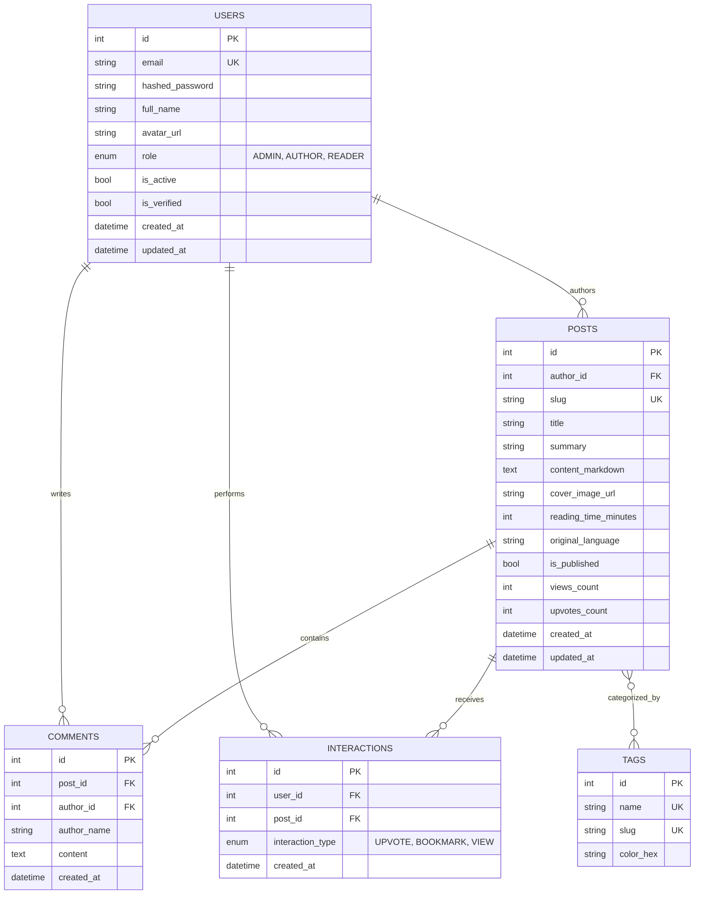

# SYS.BLOG • End-to-End Technical Specification & Architecture Manual

> **Document Version:** 2.0.0  
> **Target Audience:** Systems Architects, AI Agents, DevOps Engineers, and Full-Stack Developers  
> **Production URL:** `https://anthoruiz.dev`  
> **Local Endpoints:** Frontend: `http://localhost:3000` | Backend API: `http://localhost:8000/docs`

---

## 1. Executive Summary & System Philosophy

**SYS.BLOG** is a production-grade, self-hosted engineering publication platform and Homelab observability hub. Designed to run on consumer hardware (e.g., bare-metal laptop or mini-PC) while delivering enterprise-tier reliability, global edge distribution, zero-trust security, and real-time hardware telemetry.

### Core Architectural Tenets
1. **Edge-Routed, Zero Port-Forwarding:** No residential router ports (80/443) are opened. All ingress traffic traverses an outbound-only encrypted QUIC tunnel (`cloudflared`) to Cloudflare Anycast edge locations.
2. **Homelab Transparency:** Hardware metrics (CPU utilization %, RAM consumption %, CPU temperature °C, and OS uptime) are polled from the underlying host and rendered in real time.
3. **Role-Based Access Control (RBAC):** Strict 3-tier authorization model (`ADMIN`, `AUTHOR`, `READER`) enforced at both database queries and API route dependencies.
4. **Resilience & Autonomous Operations:** Automated rolling 7-day database backups, asynchronous non-blocking task loops, rate limiting, anti-spam honeypots, and self-healing Docker restart policies.
5. **AI Integration:** Google Gemini integration for dynamic technical reading time estimation and automated content-aware taxonomy/tag generation.

---

## 2. End-to-End System Topology

```mermaid
flowchart TD
    subgraph WAN ["Public Internet"]
        UserBrowser["Client Browser / Mobile<br/>(HTTPS https://anthoruiz.dev)"]
    end

    subgraph CF ["Cloudflare Edge Network"]
        CFDNS["Cloudflare DNS (anthoruiz.dev)"]
        CFWAF["Edge WAF & DDoS Protection"]
        CFSSL["Universal SSL/TLS Termination"]
    end

    subgraph Host ["Homelab Host Node (Windows 11 / WSL2 Ubuntu 22.04)"]
        subgraph DockerBridge ["Docker Bridge Network: devblog_net"]
            
            Tunnel["Container: devblog_tunnel<br/>(cloudflare/cloudflared:latest)<br/>Outbound QUIC Tunnel"]
            
            Nginx["Container: devblog_frontend<br/>(nginx:alpine)<br/>Port 80 (Internal) / 3000 (Host)"]
            
            FastAPI["Container: devblog_backend<br/>(python:3.10-slim)<br/>Uvicorn ASGI @ Port 8000"]
            
            Postgres[("Container: devblog_postgres<br/>(postgres:16-alpine)<br/>Port 5432 (Internal)")]
            
        end
        
        subgraph Volumes ["Host Persistent Storage"]
            V_DB[("postgres_data")]
            V_Uploads[("uploads_data")]
            V_Logs[("logs_data")]
        end
    end

    UserBrowser -->|"HTTPS:443"| CFDNS
    CFDNS --> CFWAF
    CFWAF --> CFSSL
    CFSSL <==|"Outbound QUIC Tunnel"| Tunnel
    Tunnel -->|"HTTP Proxy (frontend:80)"| Nginx
    Nginx -->|"Static React SPA Assets"| Nginx
    Nginx -->|"Proxy /api/ & /uploads/"| FastAPI
    FastAPI -->|"asyncpg Connection Pool"| Postgres
    Postgres --- V_DB
    FastAPI --- V_Uploads
    FastAPI --- V_Logs
```

---

## 3. Infrastructure & Deployment Specification

### 3.1 Host & Virtualization Layer
- **Hardware:** Consumer x86_64 Laptop / Mini PC.
- **Operating System:** Windows 11 Pro with WSL2 (Windows Subsystem for Linux 2).
- **WSL Distribution:** Ubuntu 22.04 LTS running Linux kernel 5.15+ with systemd and Docker Engine.
- **Keep-Alive Daemon:** Host execution of `wsl -d Ubuntu sleep infinity` to prevent Windows connected standby / idle suspension from freezing WSL2 virtual interfaces.

### 3.2 Container Orchestration (`docker-compose.yml`)

The complete stack is declared as four decoupled services connected via a single internal bridge network (`devblog_net`):

| Container Name | Service Name | Base Image | Internal Port | Host Port | Purpose |
|---|---|---|---|---|---|
| `devblog_postgres` | `db` | `postgres:16-alpine` | `5432` | `5432` | Relational persistence with healthcheck |
| `devblog_backend` | `backend` | Custom (`python:3.10-slim`) | `8000` | `8000` | FastAPI ASGI core, Gemini AI, Backups |
| `devblog_frontend` | `frontend` | Multi-stage (`nginx:alpine`) | `80` | `3000` | Nginx reverse proxy & React SPA delivery |
| `devblog_tunnel` | `tunnel` | `cloudflare/cloudflared:latest` | N/A | None | Encrypted outbound edge tunnel connector |

### 3.3 Network Ingress & Cloudflare Zero Trust Architecture
1. **Connector Execution:** `cloudflared` launches with the flag `--no-autoupdate run --token ${CLOUDFLARE_TUNNEL_TOKEN}`.
2. **Tunnel Negotiation:** Establishes 4 concurrent multiplexed QUIC/HTTP2 connections to geographically redundant Cloudflare Edge points of presence (PoPs).
3. **Public Hostname Mapping:**
   - Hostname: `anthoruiz.dev` (and `*.anthoruiz.dev`)
   - Origin Service: `http://frontend:80`
4. **Nginx Ingress Configuration (`frontend/nginx.conf`):**
   - **Rate Limiting:** Leaky bucket rate limiter configured at `30 requests/second` with a burst buffer of `50 requests` (`zone=api_gateway_limit:10m`). Returns HTTP 429 upon exhaustion.
   - **Static File Fallback:** `try_files $uri $uri/ /index.html;` ensures seamless HTML5 client-side React router navigation.
   - **Gzip Compression:** Active for `text/plain`, `text/css`, `application/json`, `application/javascript`, and `text/xml`.
   - **Uploads Proxying:** Static media cache headers set to 30 days (`Cache-Control: public, no-transform`).

---

## 4. Backend Architecture (FastAPI & Python 3.10)

### 4.1 Technology Stack
- **Framework:** FastAPI `>=0.110.0` (Asynchronous ASGI framework).
- **ASGI Server:** Uvicorn with auto-reload in development.
- **ORM & Driver:** SQLAlchemy `2.0+` async declarative mapping via `asyncpg`.
- **Validation & Serialization:** Pydantic `v2` schemas.
- **Security:** `passlib[bcrypt]` for password hashing, `pyjwt` for token encoding/decoding.
- **System Monitoring:** `psutil` for host hardware telemetry.
- **AI SDK:** Google Gemini API integration.

### 4.2 Database Schema & Entity Relationships



### 4.3 Security & Role-Based Access Control (RBAC)

The application implements a 3-tier hierarchical permission model:

| Role | Permissions & Capabilities |
|---|---|
| **`ADMIN`** | • Full system administration.<br/>• Trigger, inspect, and download database backups.<br/>• Promote or demote user roles (`PATCH /auth/users/{id}/role`).<br/>• Delete any post or comment.<br/>• View real-time hardware telemetry (CPU, RAM, Temp, Uptime). |
| **`AUTHOR`** | • Publish new articles (`POST /api/v1/posts`).<br/>• Edit and delete owned posts.<br/>• Upload images to local media storage (`POST /api/v1/posts/upload-image`).<br/>• Upvote, bookmark, and comment on any article. |
| **`READER`** | • Read published articles and view system latency `/status`.<br/>• Upvote and bookmark articles.<br/>• Post comments on articles.<br/>• Restricted: Cannot create or update articles. |

#### Route Security Dependencies (`backend/app/api/deps.py`):
- `get_current_user`: Validates JWT Bearer token from `Authorization` header.
- `get_current_active_user`: Asserts `user.is_active is True`.
- `require_author_or_admin`: Enforces `user.role in [UserRole.AUTHOR, UserRole.ADMIN]`.
- `require_admin`: Enforces `user.role == UserRole.ADMIN`.

#### Anti-Spam Honeypot:
Public comment and interaction endpoints inspect a silent `hp_website` field. Automated bots filling this field are silently rejected or discarded without triggering database writes.

### 4.4 Automated Database Backup Engine (`backend/app/services/backup_service.py`)
- **Execution Mechanism:** Background coroutine scheduled via FastAPI `lifespan` executing every 24 hours (`86,400s`).
- **Backup Generation:** Invokes PostgreSQL `pg_dump` via `asyncio.create_subprocess_exec` outputting timestamped SQL snapshots: `devblog_backup_YYYYMMDD_HHMMSS.sql`.
- **Rolling Retention (7-Day Rotation):** Scans the backup storage volume and automatically purges any archive files older than 7 calendar days.
- **REST Endpoints:**
  - `GET /api/v1/backups`: Lists existing snapshots with sizes and creation dates.
  - `POST /api/v1/backups/create`: Triggers an immediate snapshot.
  - `GET /api/v1/backups/download/{filename}`: Authenticated file streaming with MIME `application/octet-stream`.

### 4.5 Observability & Hardware Telemetry
- **ASGI Middleware:** Measures request processing duration down to fractional milliseconds (`ms`), appending latency headers and writing to `/app/logs/server.log`.
- **System Telemetry Service (`backend/app/api/v1/stats.py`):**
  - Uses `psutil.cpu_percent(interval=None)` and `psutil.virtual_memory()`.
  - Reads hardware thermal probes via `psutil.sensors_temperatures()`.
  - Calculates operating system uptime from `psutil.boot_time()`.
- **Latency Diagnostics (`GET /api/v1/stats/system-status`):**
  - Executes active `SELECT 1` ping against PostgreSQL measuring true round-trip database latency.
  - Returns Nginx gateway status, FastAPI memory usage, and node hostname identifier.

---

## 5. Frontend Architecture (React 18, TypeScript & Vite)

### 5.1 Technology Stack
- **Framework:** React 18.2 (Functional Components & Hooks).
- **Language:** TypeScript 5.2 (Strict type checking).
- **Bundler:** Vite 5.4 with code-splitting and chunk minification.
- **Styling:** Tailwind CSS with custom Cyber-Homelab theme.
- **Diagram Engine:** Mermaid.js with custom dark configuration.
- **Icons:** Lucide React.

### 5.2 Component Tree & Modular Hierarchy

```
frontend/src/
├── App.tsx                     # Main application container & state orchestration
├── main.tsx                    # React DOM root bootstrapping
├── index.css                   # Tailwind imports & custom scrollbar definitions
├── i18n/
│   └── index.ts                # Multilingual translation dictionaries (es, en, pt, fr)
├── types/
│   └── index.ts                # TypeScript domain models and API contracts
├── services/
│   └── api.ts                  # Axios/Fetch API client abstraction layer
├── utils/                      # Helper formatting functions (dates, byte formatting)
└── components/
    ├── Navbar.tsx              # Top navigation bar, language switcher, node status
    ├── StreakHeader.tsx        # Homelab telemetry widget & role-adaptive header
    ├── DigestCard.tsx          # 2-column high-density article digest card
    ├── ArticleModal.tsx        # Full markdown reader modal with syntax highlighting
    ├── NewPostModal.tsx        # Markdown editor, AI tag/read-time estimator, uploader
    ├── MarkdownRenderer.tsx    # Remark/Rehype markdown parser with code highlighting
    ├── MermaidRenderer.tsx     # Embedded Mermaid.js diagram viewer with copy & zoom
    ├── MarkdownToolbar.tsx     # Rich formatting toolbar for authoring
    ├── LoginModal.tsx          # Authentication & registration modal
    ├── SystemStatusModal.tsx   # Live /status Homelab latency dashboard
    ├── BackupsModal.tsx        # Admin control panel for snapshots & role testing
    └── ErrorBoundary.tsx       # React fault tolerance boundary with crash reporting
```

### 5.3 Key UI/UX Innovations

#### Adaptive Telemetry Widget (`StreakHeader.tsx`)
- **When user is `ADMIN`:** Displays full live telemetry pills: `LIVE | CPU: 1.2% | RAM: 8.7% | TEMP: 37.5°C | UP: 6h 7m | /status ↗`.
- **When user is `AUTHOR` / `READER` / Visitor:** Displays a minimalist `LIVE` (pulsing green dot) or `DOWN` (red dot) badge alongside `/status ↗`.
- **Horizontal Alignment:** The "+ New Post" button sits on the exact same row with standardized height (`h-[34px]`) preventing layout displacement.

#### Compact Tag Filter Bar with Searchable Dropdown
- Solves vertical clutter when dozens of database tags exist.
- Renders `[ All Topics ]`, `[ Bookmarks (N) ]`, and the top **6 primary tags**.
- Excess tags are tucked inside a `+N more ▾` popover containing a live search input (`Buscar etiqueta...`).
- Selecting an overflow tag dynamically pins it to the primary bar with a quick-remove `X` button.

#### Dynamic Dark Mermaid.js Integration (`MermaidRenderer.tsx`)
- Auto-detects ````mermaid code blocks inside markdown posts.
- Dynamically initializes Mermaid with dark theme configuration:
  ```typescript
  mermaid.initialize({
    startOnLoad: false,
    theme: 'dark',
    themeVariables: {
      background: '#07090e',
      primaryColor: '#06b6d4',
      primaryTextColor: '#f8fafc',
      primaryBorderColor: '#0891b2',
      lineColor: '#38bdf8'
    }
  });
  ```
- Supports full diagram types: Flowcharts (`flowchart TD/LR`), Sequence diagrams (`sequenceDiagram`), ER models (`erDiagram`), State diagrams, and Gantt charts.
- Includes interactive zoom controls and raw diagram syntax viewer.

#### Native Multilingual Dictionary (`src/i18n/index.ts`)
- Zero external heavy dependencies; pure TypeScript typed dictionary.
- Seamless instant language switching across **4 languages**:
  - 🇪🇸 Spanish (`es`)
  - 🇺🇸 English (`en`)
  - 🇧🇷 Portuguese (`pt`)
  - 🇫🇷 French (`fr`)
- Stores preference in `localStorage('devblog_lang')`.

---

## 6. Complete API Specification (REST Contract)

Base URL: `https://anthoruiz.dev/api/v1` (or `http://localhost:8000/api/v1`)

### 6.1 Authentication & User Management
| Method | Endpoint | Auth | Description |
|---|---|---|---|
| `POST` | `/auth/register` | Public | Register new user account (default role: `READER`). |
| `POST` | `/auth/login` | Public | Authenticate credentials; returns JWT `access_token`. |
| `GET` | `/auth/me` | Bearer | Retrieve profile, permissions, and role of authenticated user. |
| `PATCH` | `/auth/me/role` | Bearer | Switch role for testing in development/Homelab mode. |
| `PATCH` | `/auth/users/{id}/role` | Admin | Change another user's role (`ADMIN`, `AUTHOR`, `READER`). |

### 6.2 Posts & Content Management
| Method | Endpoint | Auth | Description |
|---|---|---|---|
| `GET` | `/posts/` | Public | List published articles with tag filter, search, and sort (`recent`, `top_voted`, `trending`). |
| `GET` | `/posts/{slug}` | Public | Retrieve full article detail and increment view count. |
| `POST` | `/posts/` | Author/Admin | Publish a new technical article. |
| `PUT` | `/posts/{slug}` | Author/Admin | Update existing article (author ownership verified). |
| `DELETE` | `/posts/{slug}` | Author/Admin | Delete article. |
| `POST` | `/posts/upload-image` | Author/Admin | Upload article cover or inline image (`multipart/form-data`). |
| `POST` | `/posts/estimate-reading-time` | Author/Admin | Gemini AI estimation of technical reading time. |
| `POST` | `/posts/suggest-tags` | Author/Admin | Gemini AI semantic tag generator. |

### 6.3 Interactions & Engagement
| Method | Endpoint | Auth | Description |
|---|---|---|---|
| `POST` | `/posts/{id}/upvote` | Public/Bearer | Toggle upvote on article. |
| `POST` | `/posts/{id}/bookmark` | Bearer | Toggle article bookmark. |
| `GET` | `/posts/user/bookmarks` | Bearer | Retrieve all bookmarked articles for current user. |
| `POST` | `/posts/{id}/comments` | Public/Bearer | Post comment (Honeypot anti-spam protected). |
| `GET` | `/posts/{id}/comments` | Public | Retrieve discussion thread for an article. |

### 6.4 Homelab Telemetry, Backups & Observability
| Method | Endpoint | Auth | Description |
|---|---|---|---|
| `GET` | `/stats/streak` | Public | Retrieve writing streak count and basic telemetry. |
| `GET` | `/stats/live-telemetry` | Public | Real-time CPU %, RAM %, Temperature, Uptime via `psutil`. |
| `GET` | `/stats/system-status` | Public | Active ping latency of PostgreSQL, FastAPI, Nginx. |
| `GET` | `/stats/tags` | Public | List all tags ordered by usage frequency. |
| `GET` | `/backups/` | Admin | List all database backup snapshots. |
| `POST` | `/backups/create` | Admin | Trigger immediate database dump. |
| `GET` | `/backups/download/{file}` | Admin | Download SQL backup snapshot. |
| `POST` | `/logs/client` | Public | React client error boundary diagnostic collector. |
| `GET` | `/logs/recent` | Admin | Tail last 100 lines of rotating server log. |

---

## 7. Environment Variables Reference

| Variable Name | Required | Default Value | Description |
|---|---|---|---|
| `POSTGRES_USER` | Yes | `devblog_user` | PostgreSQL database superuser username. |
| `POSTGRES_PASSWORD` | Yes | `devblog_secure_pass_2026` | PostgreSQL database user password. |
| `POSTGRES_DB` | Yes | `devblog` | PostgreSQL target database name. |
| `POSTGRES_PORT` | No | `5432` | PostgreSQL host listening port. |
| `SECRET_KEY` | Yes | *Random 64-char string* | Cryptographic salt for JWT token signing. |
| `ENVIRONMENT` | Yes | `production` | Runtime mode (`development` / `production`). |
| `DEBUG` | No | `False` | Enables Swagger interactive docs and verbose logs. |
| `GEMINI_API_KEY` | No | `""` | Google AI Studio API key for AI features. |
| `GEMINI_MODEL` | No | `gemini-1.5-flash` | Gemini model variant for tag and reading time tasks. |
| `CLOUDFLARE_TUNNEL_TOKEN` | Yes (for WAN) | `""` | Base64 authentication token for Cloudflare Tunnel connector. |

---

## 8. Operational Playbook & Maintenance

### 8.1 Starting the Entire Homelab Stack
```bash
# Enter Ubuntu WSL2
wsl -d Ubuntu

# Navigate to project directory
cd /mnt/c/Users/14076/OneDrive/Desktop/Blog

# Launch all 4 microservices detached
docker compose up -d
```

### 8.2 Live Observability & Log Streaming
```bash
# Stream logs from all containers
docker compose logs -f

# Stream only Cloudflare Tunnel logs
docker logs -f devblog_tunnel

# Stream only FastAPI application logs
docker logs -f devblog_backend
```

### 8.3 Rebuilding After Source Code Modifications
```bash
# Clean rebuild of frontend and backend
docker compose build --no-cache frontend backend
docker compose up -d frontend backend
```

### 8.4 Disaster Recovery & Database Restoration
In the event of database corruption or hardware migration:
```bash
# Copy snapshot into the database container
docker cp devblog_backup_YYYYMMDD_HHMMSS.sql devblog_postgres:/tmp/restore.sql

# Execute restore via psql inside the container
docker exec -i devblog_postgres psql -U devblog_user -d devblog -f /tmp/restore.sql
```

---

## 9. AI Agent Guidance & Ingestion Index

When reading, analyzing, or extending this repository:
1. **Routing Changes:** Modify `frontend/nginx.conf` and `frontend/src/App.tsx`. Remember that Nginx proxies `/api/` directly to `backend:8000/api/`.
2. **Database Schema Migrations:** Declarative models reside in `backend/app/models/`. During development, `seed_initial_data()` in `backend/app/main.py` bootstraps required seed tags and admin credentials.
3. **CORS Invariants:** In `backend/app/core/config.py`, any new public hostname must be appended to `BACKEND_CORS_ORIGINS`.
4. **OneDrive File System Invariant:** If editing files on the Windows host mapped to OneDrive, immediately stage modified files with `git add` to prevent background cloud sync from creating race conditions.
