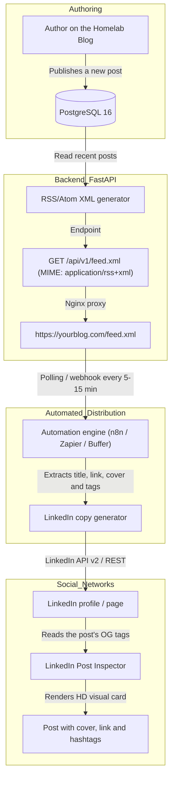

# Technical Specification and Action Plan: RSS/Atom Feed & LinkedIn Automation

**Module:** Content Syndication & Automated Social Distribution  
**Project:** DevBlog Digest & Homelab Hub  
**Status:** Documented / Pending Future Implementation  
**Date:** September 2026  

---

## 1. Executive Summary and Goal

The goal of this feature is to turn the blog into an omnichannel publishing system:
1. **Generate a standard RSS 2.0 / Atom feed:** Let readers subscribe from feed readers (Feedly, NetNewsWire, Readwise) and let automation engines detect new posts instantly.
2. **Implement OpenGraph metadata (OG tags):** Ensure that sharing blog links on LinkedIn, Twitter/X, Discord, Slack or WhatsApp renders a high-resolution card with title, cover image and summary.
3. **Automate publishing to LinkedIn:** Connect the feed to automation services (Zapier, Make, Buffer or a self-hosted **n8n** container in your Homelab) so every post published on the blog shows up in your LinkedIn feed without manual work.

---

## 2. Architecture and Automation Flow Diagram



---

## 3. Technical Specification per Component

### 3.1. RSS / Atom Feed Generator (FastAPI Backend)

* **Endpoint route:** `GET /api/v1/feed.xml`, aliased as `GET /feed.xml` through Nginx.
* **Standard format:** RSS 2.0 with the `atom:link` and `media:content` extensions.
* **Content-Type:** `application/rss+xml; charset=utf-8` or `application/xml`.
* **Required fields per post (`<item>`):**
  * `<title>`: Post title.
  * `<link>`: Canonical URL (`https://yourblog.com/posts/{slug}`).
  * `<guid isPermaLink="true">`: Persistent unique identifier.
  * `<pubDate>`: Date formatted per RFC 822 / RFC 2822 (e.g. `Sun, 27 Sep 2026 18:30:00 +0000`).
  * `<description>`: Post summary or plain-text excerpt.
  * `<content:encoded>`: Full content or excerpt as escaped HTML/Markdown (optional).
  * `<category>`: Post tags (`docker`, `fastapi`, etc.) so they can become hashtags.
  * `<media:content url="{cover_image_url}" medium="image" />`: Cover image so readers and LinkedIn pick it up immediately.

#### Example Generated XML:
```xml
<?xml version="1.0" encoding="UTF-8"?>
<rss version="2.0" 
     xmlns:atom="http://www.w3.org/2005/Atom"
     xmlns:media="http://search.yahoo.com/mrss/">
  <channel>
    <title>SYS.BLOG • Developer Digest &amp; Homelab Hub</title>
    <link>https://yourblog.com</link>
    <description>Posts about systems architecture, homelab and modern development.</description>
    <language>en</language>
    <lastBuildDate>Sun, 27 Sep 2026 18:30:00 +0000</lastBuildDate>
    <atom:link href="https://yourblog.com/feed.xml" rel="self" type="application/rss+xml" />

    <item>
      <title>Designing a queueing system with RabbitMQ on Docker</title>
      <link>https://yourblog.com/posts/event-driven-architecture-rabbitmq-docker</link>
      <guid isPermaLink="true">https://yourblog.com/posts/event-driven-architecture-rabbitmq-docker</guid>
      <pubDate>Sun, 27 Sep 2026 14:00:00 +0000</pubDate>
      <description>How to decouple microservices and process background jobs with fault tolerance.</description>
      <category>distributed-systems</category>
      <category>docker-homelab</category>
      <media:content url="https://yourblog.com/uploads/rabbitmq_cover.jpg" medium="image" />
    </item>
  </channel>
</rss>
```

---

### 3.2. OpenGraph Metadata (OG Tags) for LinkedIn Previews

When LinkedIn or Twitter/X share a link, their bots (`LinkedInBot/1.0`, `Twitterbot`) crawl the page. With a traditional React SPA (Single Page Application), the bot may only see the empty base HTML.

To guarantee proper preview cards:
1. **Basic tags in `<head>`:**
   ```html
   <meta property="og:type" content="article" />
   <meta property="og:site_name" content="SYS.BLOG" />
   <meta property="og:title" content="Post Title | SYS.BLOG" />
   <meta property="og:description" content="Summary of the technical post..." />
   <meta property="og:image" content="https://yourblog.com/uploads/post_cover.jpg" />
   <meta property="og:url" content="https://yourblog.com/posts/{slug}" />
   <meta name="twitter:card" content="summary_large_image" />
   ```
2. **Serving the SPA to social bots:**
   * **Lightweight option (recommended):** FastAPI or Nginx intercepts requests with `User-Agent: *LinkedInBot*` or `*Twitterbot*` and returns a minimal HTML template with the correct OpenGraph tags and rich content, while regular users get the React app.

---

### 3.3. Ways to Automate Publishing to LinkedIn

#### Method 1: No-code with Zapier / Make / Buffer (fastest)
* **Step 1:** Sign up for Zapier or Make.
* **Step 2:** Create a flow with the trigger **"RSS by Zapier / New Item in Feed"** pointing to `https://yourblog.com/feed.xml`.
* **Step 3:** Action: **"LinkedIn / Create Share Update"**.
* **Message template:**
  ```text
  🚀 New technical post on my Homelab Blog:
  
  {{item.title}}
  
  💡 Summary: {{item.description}}
  
  📖 Read more: {{item.link}}
  
  #SoftwareEngineering #Homelab #DevOps {{item.categories_as_hashtags}}
  ```

#### Method 2: Self-hosted with n8n on your own Docker (100% Homelab & free)
* Add an **n8n** container to `docker-compose.yml`:
  ```yaml
  n8n:
    image: n8nio/n8n:latest
    restart: unless-stopped
    ports:
      - "5678:5678"
    environment:
      - N8N_HOST=n8n.local
    volumes:
      - n8n_data:/home/node/.n8n
  ```
* In n8n, use the **RSS Read** node every 15 minutes connected to the **LinkedIn** node. Benefits: no subscription costs, unlimited executions and full privacy.

---

## 4. Step-by-Step Action Plan (for when we decide to build it)

### Phase A: Backend & RSS Endpoint
- [ ] **A.1:** Install or use native Python XML utilities (`xml.etree.ElementTree` or the `feedgen` library).
- [ ] **A.2:** Create a `backend/app/services/feed.py` service that queries the latest 20 published posts and builds the RSS 2.0 structure.
- [ ] **A.3:** Add a `GET /api/v1/feed.xml` route in `backend/app/api/v1/posts.py` returning `Response(content=xml_data, media_type="application/xml")`.
- [ ] **A.4:** Update `frontend/nginx.conf` to route `location /feed.xml` straight to the backend endpoint.

### Phase B: OpenGraph Metadata (OG Tags)
- [ ] **B.1:** Add canonical metadata and the RSS auto-discovery link to `frontend/index.html`:
  ```html
  <link rel="alternate" type="application/rss+xml" title="SYS.BLOG RSS Feed" href="/feed.xml" />
  ```
- [ ] **B.2:** Create a mini endpoint or FastAPI middleware that injects OpenGraph tags when a social bot requests a post by its slug.

### Phase C: Frontend Integration
- [ ] **C.1:** Add a button with the official RSS icon to the navigation bar (`Navbar.tsx`) and to the footer.
- [ ] **C.2:** One-click modal or toast: *"RSS feed link copied to the clipboard! Paste it into Feedly, NetNewsWire or your favorite reader"*.

### Phase D: LinkedIn Pipeline Setup
- [ ] **D.1:** Validate the XML feed with the [W3C Feed Validation Service](https://validator.w3.org/feed/).
- [ ] **D.2:** Validate the OpenGraph tags with the [LinkedIn Post Inspector](https://www.linkedin.com/post-inspector/).
- [ ] **D.3:** Connect the production link `https://<yourdomain>/feed.xml` to Zapier/Make or the n8n container and run the first automated test post.
