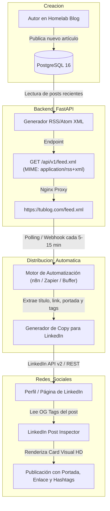

# Especificación Técnica y Plan de Acción: Feed RSS/Atom & Automatización en LinkedIn

**Módulo:** Sindicación de Contenidos & Distribución Social Automática  
**Proyecto:** DevBlog Digest & Homelab Hub  
**Estado:** Documentado / Pendiente de Implementación Futura  
**Fecha:** Septiembre 2026  

---

## 1. Resumen Ejecutivo y Objetivo

El objetivo de esta funcionalidad es transformar el blog en un sistema de publicación omnicanal:
1. **Generar un Feed RSS 2.0 / Atom estandarizado:** Permitir que los lectores se suscriban desde lectores de feeds (Feedly, NetNewsWire, Readwise) y que motores de automatización detecten nuevos posts al instante.
2. **Implementar Metadatos OpenGraph (OG Tags):** Asegurar que al compartir enlaces del blog en LinkedIn, Twitter/X, Discord, Slack o WhatsApp, se renderice una tarjeta visual de alta resolución con título, portada y resumen ejecutivo.
3. **Automatizar la Publicación en LinkedIn:** Conectar el feed con servicios de automatización (Zapier, Make, Buffer o un contenedor self-hosted de **n8n** en tu Homelab) para que cada post publicado en el blog aparezca en tu feed de LinkedIn sin intervención manual.

---

## 2. Diagrama de Arquitectura y Flujo de Automatización



---

## 3. Especificación Técnica por Componente

### 3.1. Generador de Feed RSS / Atom (Backend FastAPI)

* **Ruta del Endpoint:** `GET /api/v1/feed.xml` y alias `GET /feed.xml` mediante Nginx.
* **Formato Estándar:** RSS 2.0 con extensiones `atom:link` y `media:content`.
* **Content-Type:** `application/rss+xml; charset=utf-8` o `application/xml`.
* **Campos Requeridos por Cada Artículo (`<item>`):**
  * `<title>`: Título del post.
  * `<link>`: URL canónica (`https://tublog.com/posts/{slug}`).
  * `<guid isPermaLink="true">`: Identificador único persistente.
  * `<pubDate>`: Fecha formateada según RFC 822 / RFC 2822 (ej: `Sun, 27 Sep 2026 18:30:00 +0000`).
  * `<description>`: Resumen del artículo o extracto en texto plano.
  * `<content:encoded>`: Contenido completo o extracto en formato HTML/Markdown escapado (opcional).
  * `<category>`: Etiquetas del artículo (`docker`, `fastapi`, etc.) para que se conviertan en hashtags.
  * `<media:content url="{cover_image_url}" medium="image" />`: Imagen de portada para que los lectores y LinkedIn la identifiquen de inmediato.

#### Ejemplo de XML Generado:
```xml
<?xml version="1.0" encoding="UTF-8"?>
<rss version="2.0" 
     xmlns:atom="http://www.w3.org/2005/Atom"
     xmlns:media="http://search.yahoo.com/mrss/">
  <channel>
    <title>SYS.BLOG • Developer Digest &amp; Homelab Hub</title>
    <link>https://tublog.com</link>
    <description>Publicaciones sobre arquitectura de sistemas, homelab y desarrollo moderno.</description>
    <language>es</language>
    <lastBuildDate>Sun, 27 Sep 2026 18:30:00 +0000</lastBuildDate>
    <atom:link href="https://tublog.com/feed.xml" rel="self" type="application/rss+xml" />

    <item>
      <title>Diseñando un sistema de colas con RabbitMQ en Docker</title>
      <link>https://tublog.com/posts/arquitetura-orientada-a-eventos-rabbitmq-docker</link>
      <guid isPermaLink="true">https://tublog.com/posts/arquitetura-orientada-a-eventos-rabbitmq-docker</guid>
      <pubDate>Sun, 27 Sep 2026 14:00:00 +0000</pubDate>
      <description>Cómo desacoplar microservicios y procesar tareas en background con tolerancia a fallos.</description>
      <category>distributed-systems</category>
      <category>docker-homelab</category>
      <media:content url="https://tublog.com/uploads/rabbitmq_cover.jpg" medium="image" />
    </item>
  </channel>
</rss>
```

---

### 3.2. Metadatos OpenGraph (OG Tags) para Previsualización en LinkedIn

Cuando LinkedIn o Twitter/X comparten un enlace, rastrean la página con sus bots (`LinkedInBot/1.0`, `Twitterbot`). Si la aplicación es una SPA (Single Page Application) tradicional de React, el bot puede ver solo el HTML base vacío.

Para garantizar tarjetas gráficas perfectas:
1. **Etiquetas Básicas en `<head>`:**
   ```html
   <meta property="og:type" content="article" />
   <meta property="og:site_name" content="SYS.BLOG" />
   <meta property="og:title" content="Título del Post | SYS.BLOG" />
   <meta property="og:description" content="Resumen ejecutivo del post técnico..." />
   <meta property="og:image" content="https://tublog.com/uploads/portada_post.jpg" />
   <meta property="og:url" content="https://tublog.com/posts/{slug}" />
   <meta name="twitter:card" content="summary_large_image" />
   ```
2. **Manejo de SPA para Bots Sociales:**
   * **Opción Ligera (Recomendada):** El backend FastAPI o Nginx intercepta peticiones que tengan `User-Agent: *LinkedInBot*` o `*Twitterbot*` y devuelve una plantilla HTML mínima con las etiquetas OpenGraph correctas y el contenido enriquecido, mientras que a los usuarios normales les entrega la aplicación React.

---

### 3.3. Métodos para Automatizar la Publicación en LinkedIn

#### Método 1: No-Code con Zapier / Make / Buffer (El más rápido)
* **Paso 1:** Registrar cuenta en Zapier o Make.
* **Paso 2:** Crear flujo con disparador: **"RSS by Zapier / New Item in Feed"** apuntando a `https://tublog.com/feed.xml`.
* **Paso 3:** Acción: **"LinkedIn / Create Share Update"**.
* **Plantilla de mensaje configurada:**
  ```text
  🚀 Nuevo artículo técnico en mi Homelab Blog:
  
  {{item.title}}
  
  💡 Resumen: {{item.description}}
  
  📖 Lectura completa: {{item.link}}
  
  #SoftwareEngineering #Homelab #DevOps {{item.categories_as_hashtags}}
  ```

#### Método 2: Self-Hosted con n8n en tu propio Docker (100% Homelab & Gratuito)
* Añadir un contenedor de **n8n** en `docker-compose.yml`:
  ```yaml
  n8n:
    image: n8nio/n8n:latest
    restart: unless-stopped
    ports:
      - "5678:5678"
    environment:
      - N8N_HOST=n8n.local
    volumes:
      - n8n_data:/home/node/.n8n
  ```
* En n8n, se usa el nodo **RSS Read** cada 15 minutos conectado al nodo **LinkedIn**. Ventajas: cero costos de suscripción, ejecuciones ilimitadas y privacidad total.

---

## 4. Plan de Acción Paso a Paso (Para cuando decidamos implementarlo)

### Fase A: Backend & Endpoint RSS
- [ ] **A.1:** Instalar o utilizar utilidades XML nativas de Python (`xml.etree.ElementTree` o biblioteca `feedgen`).
- [ ] **A.2:** Crear servicio `backend/app/services/feed.py` que consulte los últimos 20 artículos publicados y arme la estructura RSS 2.0.
- [ ] **A.3:** Crear ruta `GET /api/v1/feed.xml` en `backend/app/api/v1/posts.py` con respuesta `Response(content=xml_data, media_type="application/xml")`.
- [ ] **A.4:** Actualizar `frontend/nginx.conf` para rutear `location /feed.xml` directamente hacia el endpoint del backend.

### Fase B: Metadatos OpenGraph (OG Tags)
- [ ] **B.1:** Agregar metadatos canónicos y link de auto-discovery de RSS en `frontend/index.html`:
  ```html
  <link rel="alternate" type="application/rss+xml" title="SYS.BLOG RSS Feed" href="/feed.xml" />
  ```
- [ ] **B.2:** Crear mini-endpoint o middleware en FastAPI para inyectar tags OpenGraph cuando un bot social solicite un artículo por su slug.

### Fase C: Integración en Frontend
- [ ] **C.1:** Agregar botón con el ícono oficial de RSS en la barra de navegación (`Navbar.tsx`) y en el pie de página (`footer`).
- [ ] **C.2:** Modal o notificación con un clic: *"¡Enlace del Feed RSS copiado al portapapeles! Pégalo en Feedly, NetNewsWire o tu lector favorito"*.

### Fase D: Configuración del Pipeline hacia LinkedIn
- [ ] **D.1:** Validar el feed XML con el [W3C Feed Validation Service](https://validator.w3.org/feed/).
- [ ] **D.2:** Validar las etiquetas OpenGraph con el [LinkedIn Post Inspector](https://www.linkedin.com/post-inspector/).
- [ ] **D.3:** Conectar el enlace de producción `https://<tudominio>/feed.xml` a Zapier/Make o al contenedor n8n y realizar la primera publicación automática de prueba.
