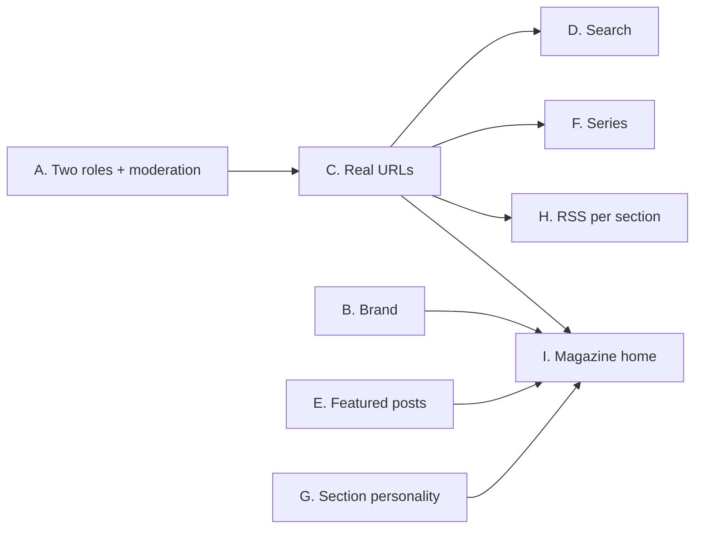

# Implementation Plan v2: Roles, Routing, Discovery and Section Identity

**Project:** SYS.BLOG (blog.anthoruiz.dev)  
**Status:** Approved — all decisions taken (2026-09-30); executing phase by phase with a backup and deploy after each phase  
**Date:** 2026-09-30  
**Builds on:** Phase 1 (pagination) and Phase 2 (sections, Alembic, AI tag validation), both deployed.

---

## 1. Scope

| # | Item | Summary |
|---|------|---------|
| A | **Two roles** | `ADMIN` and `CREATOR` only. Anonymous visitors are readers. Signing up creates a `CREATOR`. One admin for now; the admin can promote others. |
| B | **Brand** | Move from "SYS.BLOG · Developer Digest & Homelab Hub" to an identity that fits a multi-topic personal blog. |
| C | **Real URLs** (former Phase 3) | React Router: `/`, `/<section>`, `/posts/<slug>`, `/tags/<slug>`, `/series/<slug>`, `/search`. Prerequisite for RSS links, series pages and sharing. |
| D | **Search with section filter** | Search box with section selector, results page with pagination, shareable URL. |
| E | **Featured posts per section** | Pin up to two posts at the top of each section. |
| F | **Series / learning paths** | "System Design for Interviews, part 1 of 6" with previous/next navigation and a series page. |
| G | **Section personality** | Per-section visual tone, optional content notice per post, per-section footer (e.g. help resources under Mental Health). |
| H | **RSS per section** | `/feed.xml` plus `/<section>/feed.xml`. Implements `FEAT_RSS_LINKEDIN_SPEC.md`. |
| I | **Magazine home** (former Phase 4) | The approved home design: featured post, one block per section, "All posts" with Load more. |

---

## 2. Decisions Needed

### D1 — Moderation for open sign-up — **Decided: option 1, review queue**
Today anyone can register (`POST /auth/register`) and gets `READER`, which cannot publish. If every new account becomes `CREATOR`, **any visitor could publish on the public blog immediately** (spam, defacement, illegal content, abuse of the shared AI quota and upload storage).

| Option | How it works | Trade-off |
|---|---|---|
| **1. Review queue (recommended)** | Creators write and submit; posts stay `pending_review` until the admin approves. The admin can mark a creator as *trusted* to skip review. | Safe by default, little friction for trusted creators; needs a small review UI. |
| 2. Invite-only sign-up | Registration requires an invite code generated by the admin. Creators publish directly. | Very safe; nobody can join without an invite. |
| 3. Publish directly | Exactly as requested, no gate. | Not recommended for a public site. |

### D2 — Comments from anonymous readers — **Decided: keep anonymous comments**
Anonymous comments are allowed today (honeypot + 5/min rate limit). Keep them (recommended, readers stay anonymous by design) or require an account.

### D3 — Brand name — **Decided: personal blog, from the personal brand book** (`SITE_NAME` "Anthony Ruiz", tagline "I build it at home before I trust it at scale.", monogram `>ar_`, Inter + JetBrains Mono, "Views are my own" footer). The fake writing-streak counter (`max(14, posts × 2)`) is removed from the public home together with the telemetry header.
Options: keep "SYS.BLOG" but with a broader tagline; "Anthony Ruiz — Notes on code, AI, careers and life"; or a new name. The server telemetry header leaves the public home in every option (it stays in the admin status page).

### D4 — Mental Health help resources — **Decided: personal-experience disclaimer.** Mental Health posts share the author's own experience, not professional advice; the section footer (admin-editable) says so and points to findahelpline.com.
The footer shown under Mental Health posts should link to resources the admin chooses (e.g. a local crisis line and an international directory such as findahelpline.com). The text is admin-editable; no resources are hardcoded.

---

## 3. Order and Dependencies

Recommended sequence: **A → B → C → D → E → F → G → H → I**. A goes first because it changes who can write; C unlocks every page-based feature. B only needs the decision to start (copy and config).

Size legend: **S** ≈ half a day, **M** ≈ 1–2 days, **L** ≈ 3+ days.

---

## 4. Phases

### A. Two roles: ADMIN and CREATOR — **M** (+M with the review queue)

**Target model**

| Actor | Can |
|---|---|
| Anonymous (reader) | Read, search, upvote, bookmark (client hash), comment (per D2), subscribe to RSS |
| `CREATOR` | Everything above + create/edit/delete own posts, upload images, create tags, AI features. With D1 option 1: publishing goes through review unless trusted |
| `ADMIN` | Everything, on any post; manage users and roles, sections, backups, media, telemetry; approve posts |

**Backend**
- Migration `0004_two_roles`:
  - `ALTER TYPE userrole RENAME VALUE 'AUTHOR' TO 'CREATOR'`
  - `UPDATE users SET role = 'CREATOR' WHERE role = 'READER'`
  - Drop `READER`: Postgres cannot remove an enum value, so create `userrole_v2 ('ADMIN','CREATOR')`, `ALTER COLUMN role TYPE userrole_v2 USING role::text::userrole_v2`, drop the old type, rename.
  - Downgrade: recreate `READER` and map `CREATOR` back to `AUTHOR` (former readers cannot be told apart; documented).
- `UserRole` enum: `ADMIN`, `CREATOR`; default `CREATOR`.
- Registration and Google sign-in always create `CREATOR`. Remove the "first user becomes ADMIN" rule (the seed guarantees the admin).
- Rename dependency `get_current_author_or_admin` → `get_current_creator_or_admin`.
- Admin role changes: keep `PUT /auth/users/{id}/role`; extend the last-admin guard so the **last** admin can never be demoted (today only self-demotion is blocked).
- Per-user rate limits for AI endpoints and uploads (the free AI quota is shared by all creators).
- **With D1 option 1:** `posts.status` enum `draft | pending_review | published | rejected` (replaces `is_published`, migrated in the same revision), `users.is_trusted`, endpoints `GET /admin/review`, `POST /admin/posts/{id}/approve|reject` (with a reason). Only `published` posts are public.
- **With D1 option 2:** `invites` table (code, created_by, used_by, expires_at), `POST /admin/invites`, registration requires a valid code.

**Frontend**
- `UserRole = 'ADMIN' | 'CREATOR'`; update App, Navbar, BackupsModal, StreakHeader and the role-testing bar.
- "New Post" shown to any signed-in user; anonymous visitors see "Sign in to write".
- Admin panel → Users: role selector with two options.
- With option 1: "Submit for review" button for untrusted creators, status badges on own posts, admin review queue tab.

**Verification:** migration on a copy of production (only the admin exists today) and on dev data; `alembic check`; sign-up → `CREATOR`; last-admin guard; with option 1, a pending post is invisible to anonymous readers and to other creators.

---

### B. Brand — **S** (after D3)
- `SITE_NAME`, `SITE_TAGLINE` in settings (served by a public `GET /site` endpoint so frontend, RSS and OpenGraph share them).
- Update navbar, `<title>`, footer, i18n copy, README.
- Remove the telemetry/streak header from the public home; keep telemetry in the admin status modal.

---

### C. Real URLs with React Router — **L**
- Add `react-router-dom`; routes:
  - `/` home · `/:sectionSlug` section page (`?page=N`) · `/posts/:slug` post page (replaces the modal) · `/tags/:tagSlug` · `/series/:seriesSlug` (after F) · `/search?q=&section=`
  - Keep `#/status` and `#/backups` working (redirect to `/admin/status`, `/admin/backups`).
- Nginx already falls back to `index.html`; reserve `/api`, `/uploads`, `/feed.xml`, `/<section>/feed.xml` before the SPA fallback.
- Section slugs must never collide with fixed routes (`posts`, `tags`, `series`, `search`, `admin`): validate in the section editor.
- Post page: server-side 404 for unknown slugs is not possible in a SPA; show a client 404 page.
- Canonical post URL `https://blog.anthoruiz.dev/posts/<slug>` used by RSS and OpenGraph (H).

**Verification:** deep links load directly, back/forward work, old hash links still open.

---

### D. Search with section filter — **M**
- Backend: `GET /posts` already supports `q` and `section`. Upgrade `q` to PostgreSQL full-text search:
  - Migration: generated `tsvector` column over title (weight A), summary (B) and content (C) with a GIN index; `simple` configuration so Spanish and English posts both match.
  - Rank by `ts_rank` when `q` is present; keep `ILIKE` fallback for very short queries.
- Frontend: search input with a section dropdown in the navbar; `/search` results page with pagination, highlighted matches in title/summary, and "no results" state.

**Verification:** results scoped to the section; pagination totals match; Spanish and English terms both found.

---

### E. Featured posts per section — **S**
- `posts.featured_at` (nullable timestamp). At most **two** featured posts per section, enforced in the API (featuring a third returns 409 with a clear message).
- `POST /admin/posts/{id}/feature`, `DELETE /admin/posts/{id}/feature` (admin only).
- `GET /posts?section=x&featured=true`.
- UI: "Feature" toggle in the post card menu (admin); a "Featured" band at the top of each section page.

---

### F. Series / learning paths — **M**
- Model: `series` (id, title, slug, description, section_id, cover_image_url, created_by); `posts.series_id` + `posts.series_position`, unique `(series_id, series_position)`.
- API: CRUD for series (creators manage their own, admin all); `GET /series/{slug}` with ordered posts; post responses include `series: {slug, title, position, total, prev, next}`.
- Editor: optional "Series" picker with position (append at end by default; reorder in the series page).
- Post page: "Part 3 of 6" header and previous/next links; series page with the ordered list and progress.
- Only published posts count in "part N of M" for readers.

---

### G. Section personality — **M**
- `sections.theme` (`default` | `calm` | `vivid`), `sections.footer_markdown` (admin-editable, rendered below every post of the section), editable in the Sections admin tab.
- `posts.content_notice` (optional short text) shown as a dismissible notice before the article body ("This post discusses anxiety and burnout").
- `calm` theme for Mental Health: softer palette, larger line height, no neon accents, no telemetry-style monospace labels.
- Mental Health footer seeded empty; the admin fills it with the resources chosen in D4.

---

### H. RSS per section — **M**
Implements `docs/plans/FEAT_RSS_LINKEDIN_SPEC.md`, extended per section.
- `GET /api/v1/feed.xml` (all sections) and `GET /api/v1/sections/{slug}/feed.xml`; latest 20 published posts, RSS 2.0 with `atom:link`, `media:content` (cover) and `<category>` (tags).
- Nginx aliases: `/feed.xml` and `/<section>/feed.xml`.
- Auto-discovery `<link rel="alternate">` in `index.html` and on section pages; RSS buttons in the footer and section headers.
- OpenGraph tags for social previews (spec 3.2) can follow once post URLs exist.

**Verification:** W3C Feed Validator on both feeds; links point to canonical post URLs.

---

### I. Magazine home — **M**
The approved design (claude.ai artifact "Blog Home Redesign"): featured post + latest column, one block per section (lead post + two more + "View all"), "Browse by tag", "All posts" with Load more. Uses E (featured), G (section colors/themes) and C (links).

---

## 5. Cross-cutting

- **Migrations:** one Alembic revision per phase, tested on a copy of production before deploying; backup before every deploy (as done for Phase 2).
- **i18n:** every new UI string in es/en/pt/fr.
- **Docs:** README and `ARCHITECTURE_E2E.md` updated per phase; the route table check (every router path documented) keeps running.
- **Security:** creator content is user-generated: keep markdown sanitization, upload validation and rate limits; with D1 option 1 nothing a creator writes is public before review.
- **Commits:** backend, frontend and docs committed separately within each phase; deploy with `./deploy.sh` after each phase.

---

## 6. Summary

| Phase | Size | Depends on | Needs decision |
|---|---|---|---|
| A. Two roles + review queue | M + M | — | ✅ D1, D2 |
| B. Brand | S | — | ✅ D3 |
| C. Real URLs | L | — | — |
| D. Search | M | C | — |
| E. Featured posts | S | — | — |
| F. Series | M | C | — |
| G. Section personality | M | — | D4 |
| H. RSS per section | M | C | — |
| I. Magazine home | M | B, C, E, G | — |
